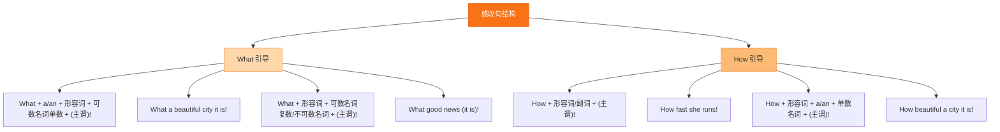

# Unit 4·重点梳理

标签：#Unit4 #语法梳理 #感叹句 #ed与ing形容词

## 一、本单元语法总览

Unit 4 的语法核心：**感叹句（What.../How...）**、**-ed/-ing 形容词辨析**、**现在进行时巩固**。感叹句是本单元新授语法，也是期中期末的必考句型转换题。

## 二、感叹句的两大句式

| 句式 | 结构 | 例句 |
|---|---|---|
| What 型 | What + a/an + 形容词 + 单数可数名词 (+ 主谓)! | What a funny joke (it is)! |
| | What + 形容词 + 复数名词/不可数名词 (+ 主谓)! | What beautiful flowers! / What fine weather! |
| How 型 | How + 形容词/副词 (+ 主谓)! | How fast he runs! |

**判断口诀**：中心词是名词用 What，是形容词或副词用 How。

**互换**：What an interesting book it is! = How interesting the book is!

## 三、陈述句改感叹句三步法

以 The game is very exciting. 为例：

1. 找中心词：exciting（形容词）→ 用 How。
2. 搬到句首：How exciting...
3. 补上主谓：How exciting the game is!

若改 What 型：加名词化包装 → What an exciting game it is!

## 四、-ed 形容词与 -ing 形容词

| -ed（人的感受） | -ing（事物的性质） |
|---|---|
| bored 感到无聊 | boring 令人无聊 |
| excited 感到兴奋 | exciting 令人兴奋 |
| interested 感兴趣 | interesting 有趣的 |
| relaxed 感到放松 | relaxing 令人放松 |
| surprised 感到惊讶 | surprising 令人惊讶 |

**口诀**：人 -ed，物 -ing；be interested in 固定搭配。

## 五、现在进行时快速回顾

- 结构：**am/is/are + doing**；标志词：now, look, listen, at the moment。
- 变化规则：make → making（去 e）；run → running（双写）；play → playing（直接加）。
- 与一般现在时对比：I usually read books, but now I **am playing** chess.

## 结构图示

## 六、易错点提醒

- What a fine weather ❌ → What fine weather ✔（weather 不可数，不加 a）。
- How a beautiful girl ❌ → How 后不能接 a + 名词。
- 感叹句主谓可以省略：What a day! ✔。
- exciting news（news 令人兴奋）与 excited people（人感到兴奋）不能互换。

## 七、小练习

1. ______ cold weather it is!（What/How）
2. ______ carefully she is listening!（What/How）
3. The film is so ______ (bore) that many people are sleeping.
4. 陈述句改感叹句：It is a very relaxing afternoon. → ______
5. 改错：What an exciting the game is!

**答案**：1. What（中心词 weather 名词，不可数不加 a）2. How 3. boring 4. What a relaxing afternoon it is! 5. 去掉 an 后的 the... → How exciting the game is! 或 What an exciting game it is!

相关：[[The art of having fun（娱乐的艺术）]] ｜ [[Unit 4·综合练习]] ｜ [[Unit 3·重点梳理]]
