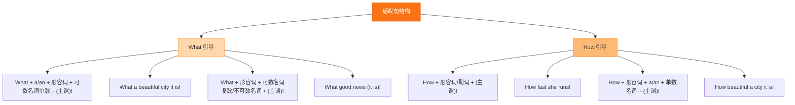

# Unit 4·综合练习

标签：#Unit4 #单元测试 #综合练习

## 一、练习说明

覆盖 Unit 4 核心：娱乐活动词汇、感叹句、-ed/-ing 形容词、现在进行时。建议限时 25 分钟。

## 二、单项选择

1. ______ fun it is to play board games with friends!
   A. What a B. What C. How
2. ______ exciting film we watched last night!
   A. What an B. How an C. What
3. Listen! Someone ______ the piano in the next room.
   A. plays B. is playing C. played
4. I was ______ at the ______ news.
   A. surprised; surprising B. surprising; surprised C. surprised; surprised
5. It's dangerous ______ near the busy road.
   A. play B. playing C. to play
6. We had great fun ______ kites on the beach.
   A. fly B. flying C. to fly
7. — What are you doing? — I ______ a magazine on the couch.
   A. read B. am reading C. reading
8. ______ carefully the students are listening!
   A. What B. How C. What a

## 三、用所给词的适当形式填空

1. Look! The children ______ (swim) in the pool.
2. What a ______ (relax) afternoon we are having!
3. He felt ______ (bore) because the talk was too long.
4. How ______ (interest) the story is!
5. They are ______ (run) after the ball on the playground.

## 四、按要求改写句子

1. The joke is very funny.（改为 How 型感叹句）→ ______
2. It is a very exciting match.（改为 What 型感叹句）→ ______
3. They are playing cards at home.（对画线部分提问，画线：playing cards）→ ______
4. fun, what, we, at, had, the picnic（连词成句）→ ______

## 五、汉译英

1. 多么有趣的游戏啊！
2. 看！他们正在公园里野餐。
3. 我对户外活动很感兴趣。
4. 别把所有时间都花在屏幕上。

## 结构图示

## 六、参考答案

**二、单项选择**
1. B（fun 不可数，不加 a）2. A（exciting 元音开头用 an）3. B（Listen! 是进行时标志）4. A（人 -ed，物 -ing）5. C（It's + adj + to do）6. B（have fun doing）7. B 8. B（中心词 carefully 副词用 How）

**三、词形填空**
1. are swimming 2. relaxing 3. bored 4. interesting 5. running（双写 n）

**四、改写句子**
1. How funny the joke is!
2. What an exciting match it is!
3. What are they doing at home?
4. What fun we had at the picnic!

**五、汉译英**
1. What an interesting game (it is)! / How interesting the game is!
2. Look! They are having a picnic in the park.
3. I'm interested in outdoor activities.
4. Don't spend all your time on screens.

## 七、易错提醒

- 第 1、8 题：fun 是不可数名词（What fun!），carefully 是副词（How carefully...!），先辨词性再选 What/How。
- 第 4 题："人感到 -ed，物令人 -ing"，两空主体不同。
- 词形填空第 5 题：run 双写 n 再加 ing，与 swim → swimming 同理。

相关：[[The art of having fun（娱乐的艺术）]] ｜ [[Unit 4·重点梳理]]
