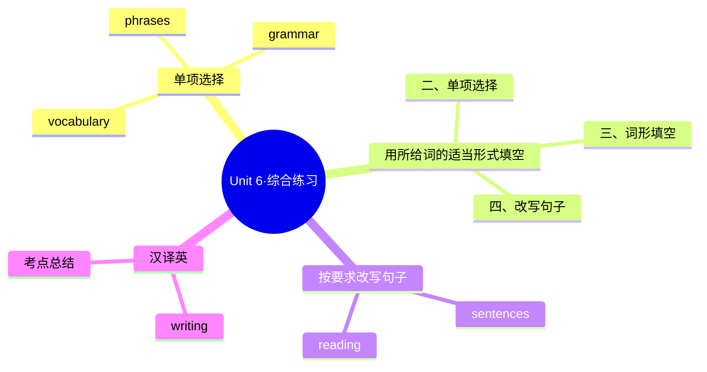

# Unit 6·综合练习

标签：#Unit6 #单元测试 #综合练习 #期末综合

## 一、练习说明

覆盖 Unit 6 核心：旅行词汇、形容词最高级、be going to 计划表达，并综合全学期的过去时与比较级。建议限时 30 分钟。

## 二、单项选择

1. The Sahara is ______ desert in the world.
   A. big B. bigger C. the biggest
2. Hangzhou is one of ______ cities in China.
   A. the most beautiful B. most beautiful C. the more beautiful
3. — How are you going to the airport? — ______ taxi.
   A. On B. By C. Take
4. We ______ a trip to Chengdu next month. I can't wait!
   A. take B. took C. are going to take
5. Of all the seasons, I like autumn ______.
   A. good B. better C. best
6. The train arrived ______ Beijing at nine in the morning.
   A. at B. in C. to
7. Travelling by plane is ______ than by train, but it's also more expensive.
   A. fast B. faster C. fastest
8. — What did you do during the trip last month? — We ______ the old town and ate local food.
   A. explore B. explored C. are going to explore

## 三、用所给词的适当形式填空

1. This is ______ (unforgettable) journey of my life.
2. August is ______ (hot) month of the year in my hometown.
3. Which is ______ (far) from Earth, the moon or the sun?
4. They ______ (go) hiking tomorrow, so they are packing now.
5. Last summer we ______ (choose) to travel by train and enjoyed the scenery.

## 四、按要求改写句子

1. Tom is taller than any other boy in his class.（改为最高级同义句）→ ______
2. We are going to visit the museum this Saturday.（改为一般疑问句）→ ______
3. I like spring best of all the seasons.（对画线部分提问，画线：spring）→ ______
4. the, is, best, to, time, spring, visit, the town（连词成句）→ ______

## 五、汉译英

1. 长城是世界上最著名的景点之一。
2. 我们打算下周日去远足。
3. 三种方式中，坐火车是最便宜的。
4. 这次旅行让我们的暑假难以忘怀。

## 结构图示

## 六、参考答案

**二、单项选择**
1. C（in the world 提示最高级）2. A（one of the + 最高级 + 复数）3. B（by + 交通工具）4. C（next month 表计划）5. C（like... best 固定搭配）6. B（arrive in + 大地点）7. B（than 提示比较级）8. B（last month 用过去时）

**三、词形填空**
1. the most unforgettable 2. the hottest（双写 t）3. farther 4. are going to go 5. chose（choose 的过去式）

**四、改写句子**
1. Tom is the tallest boy in his class.
2. Are you going to visit the museum this Saturday?
3. Which season do you like best of all the seasons?
4. Spring is the best time to visit the town.

**五、汉译英**
1. The Great Wall is one of the most famous places in the world.
2. We are going to go hiking next Sunday.
3. Travelling by train is the cheapest of the three.
4. The trip made our summer holiday unforgettable.

## 七、易错提醒

- 第 6 题：arrive in + 城市/国家，arrive at + 车站/机场等小地点。
- 第 8 题：时间标志词决定时态——last month 过去时，next month 用 be going to。
- 词形填空第 5 题：choose → chose，只差一个 o，拼写高频易错。

相关：[[Hitting the road（踏上旅途）]] ｜ [[Unit 6·重点梳理]] ｜ [[Unit 1·重点梳理]]
