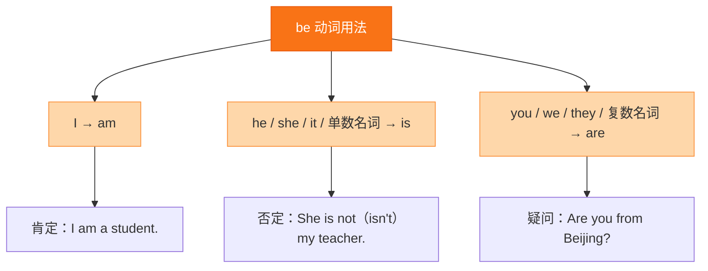

# Unit 2 Starting out

标签：#Unit2 #StartingOut #与人相处 #频度副词

## 一、课文精讲

Starting out 是 Unit 2 *Getting along* 的导入环节。教材通过图片、视频或短对话，引导学生思考"如何与家人、朋友、同学相处"。本环节重点激活与"人际关系"相关的词汇，如 family, friend, classmate, neighbour 等，并通过小调查了解彼此的日常相处方式。

课堂活动常包括：讨论"好朋友应该具备哪些品质"；用 How often...? 询问朋友见面或联系的频率；分享自己的一次成功化解矛盾的经历。

## 二、重点词汇

- **get on with** 与……相处  **get along with** 与……相处
- **argue** v. 争论  **argument** n. 争论
- **fight** v./n. 打架；争吵  **communicate** v. 交流
- **share** v. 分享  **help** v. 帮助
- **trust** v./n. 信任  **understand** v. 理解
- **always** adv. 总是  **usually** adv. 通常
- **often** adv. 经常  **sometimes** adv. 有时
- **never** adv. 从不  **hardly ever** 几乎不

## 三、语法要点

**频度副词**

频度副词表示动作发生的频率，通常放在实义动词之前、be 动词/助动词/情态动词之后。

- 实义动词前：I **often** play basketball after school.
- be 动词后：She **is always** kind to others.
- 助动词后：Do you **usually** walk to school?

频率从高到低：**always > usually > often > sometimes > hardly ever > never**

## 四、易错点

1. 频度副词位置错误：❌ *I play often basketball.* → ✅ I **often play** basketball.
2. hardly 本身已有否定含义，不可再与 not 连用：❌ *I don't hardly ever argue.* → ✅ I **hardly ever** argue.
3. How often 问频率，回答用频度副词或 once/twice a week。

## 结构图示

## 五、练习题

1. 连词成句：usually / I / my / with / homework / help / mother (.)
2. 用频度副词填空：
   - She ______（总是）gets up early.
   - They ______（从不）eat junk food.
3. 对划线部分提问：I visit my grandparents twice a month. → ______ ______ do you visit your grandparents?
4. 汉译英：我通常放学后和朋友打篮球。

**答案**：1. I usually help my mother with my homework.  2. always; never  3. How often  4. I usually play basketball with my friends after school.

相关：[[Understanding ideas]] ｜ [[Developing ideas]] ｜ [[Presenting ideas]] ｜ [[Reflection]]
