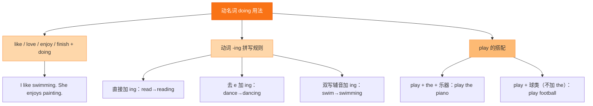

# Unit 2 Developing ideas

标签：#Unit2 #DevelopingIdeas #建议表达 #动名词

## 一、课文精讲

Developing ideas 是 Unit 2 的拓展与运用板块。本环节通过对话、短文或听力材料，进一步探讨"如何化解矛盾、提出合理建议"。学生需要学会用委婉、礼貌的方式给他人提建议，并能就具体问题表达自己的看法。

课文常以"朋友之间发生误会"或"家庭成员之间需要沟通"为背景，呈现多种建议句型，如 Why not talk to her? / How about writing a letter? 等。

## 二、重点词汇

- **advice** n. 建议（不可数）  **suggestion** n. 建议（可数）
- **advise** v. 建议  **suggest** v. 建议
- **worried** adj. 担心的  **upset** adj. 难过的
- **lonely** adj. 孤独的  **nervous** adj. 紧张的
- **calm down** 冷静下来  **cheer up** 振作起来
- **keep a secret** 保守秘密  **tell the truth** 说实话
- **be sorry for** 为……感到抱歉  **say sorry to** 向……道歉

## 三、语法要点

**提建议的常用句型**

| 句型 | 结构 | 例句 |
|---|---|---|
| Let's ... | 动词原形 | **Let's** talk about it. |
| Why not ...? | 动词原形 | **Why not** say sorry to her? |
| Why don't you ...? | 动词原形 | **Why don't you** write a letter? |
| How about ...? / What about ...? | doing | **How about** going for a walk? |
| You should / shouldn't ... | 动词原形 | You **should** listen to her. |
| Maybe you can ... | 动词原形 | Maybe you can **call** him back. |

**注意**：about 是介词，后接 **doing**；Let's / Why not 后接 **动词原形**。

## 四、易错点

1. How about 后接 doing：❌ *How about go out?* → ✅ How about **going** out?
2. advice 不可数，不能说 an advice；suggestion 可数，可说 a suggestion。
3. Let's 包含说话双方，Let us 不一定包含对方：Let's go.（我们一起走。）

## 结构图示

## 五、练习题

1. 单项选择：______ going shopping this afternoon?（A. Why not  B. Let's  C. How about）
2. 同义句转换：Why don't you talk to your parents? = ______ talk to your parents?
3. 用所给词适当形式填空：
   - What about ______ (have) a picnic?
   - You should ______ (apologise) to your friend.
4. 汉译英：你为什么不当面向她道歉呢？

**答案**：1. C  2. Why not  3. having; apologise  4. Why not apologise to her face to face?

相关：[[Starting out]] ｜ [[Understanding ideas]] ｜ [[Presenting ideas]] ｜ [[Reflection]]
