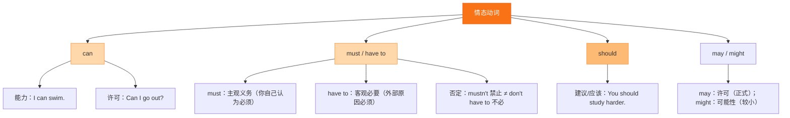

# Unit 2 Presenting ideas

标签：#Unit2 #PresentingIdeas #建议信 #综合输出

## 一、课文精讲

Presenting ideas 是 Unit 2 的综合输出板块。学生需要围绕"Getting along"主题，完成一项实际任务，例如给朋友写一封建议信、设计一份"友好相处公约"，或进行小组讨论展示如何化解同学矛盾。

本环节强调语言的得体性：提出建议时要注意语气礼貌，既要说明问题，也要给出具体可行的办法。常用结构为：表达理解 → 提出建议 → 给予鼓励。

## 二、重点词汇

- **problem** n. 问题  **trouble** n. 麻烦
- **advice** n. 建议  **suggestion** n. 建议
- **rule** n. 规则  **agreement** n. 协议
- **polite** adj. 礼貌的  **rude** adj. 粗鲁的
- **kind** adj. 善良的  **patient** adj. 有耐心的
- **in my opinion** 在我看来  **in fact** 事实上
- **on the one hand ... on the other hand** 一方面……另一方面……

## 三、语法要点

**should / shouldn't 的用法**

should 是情态动词，意为"应该"，表示建议、劝告或义务。

- 肯定：You **should** talk to your friend calmly.
- 否定：You **shouldn't** shout at others.
- 疑问：**Should** I say sorry first? — Yes, you should. / No, you shouldn't.

情态动词特点：后接动词原形；无人称和数的变化；否定直接加 not。

**建议信常用句式**：

- I'm sorry to hear that you have some trouble with ...
- In my opinion, you should ...
- Why not try to ...?
- I hope things will get better soon.

## 四、易错点

1. should 后接动词原形：❌ *You should to talk.* → ✅ You **should talk**.
2. shouldn't 不是 should not 的口语缩写，两者都可用。
3. 建议信要分段，开头表达关心，中间给出建议，结尾表达祝愿。

## 结构图示

## 五、练习题

1. 单项选择：You ______ argue with your classmates.（A. should  B. shouldn't  C. don't）
2. 连词成句：should / listen / you / to / carefully / others (.)
3. 写作：你的朋友 Lily 和同学发生了矛盾，请给她写一封 60 词左右的建议信，至少给出两条建议。

**答案**：1. B  2. You should listen to others carefully.  3. （略）

相关：[[Starting out]] ｜ [[Understanding ideas]] ｜ [[Developing ideas]] ｜ [[Reflection]]
