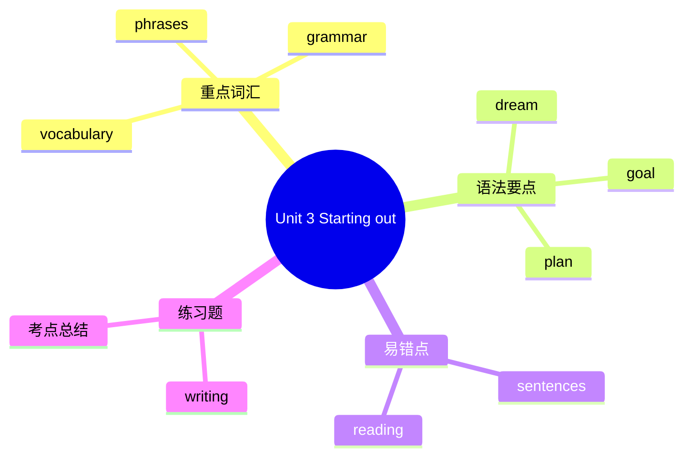

# Unit 3 Starting out

标签：#Unit3 #StartingOut #计划与梦想 #beGoingTo

## 一、课文精讲

Starting out 是 Unit 3 *Make it happen!* 的导入环节。教材通过图片、名人故事或学生对话，引导学生思考"梦想与计划"的重要性。本环节重点激活与"未来打算"相关的词汇，如 dream, goal, plan, future 等，并通过讨论让学生初步接触 be going to 结构。

课堂活动常包括：分享自己的梦想职业；用 "I'm going to ..." 表达近期计划；讨论实现梦想需要付出的努力。

## 二、重点词汇

- **dream** n./v. 梦想  **goal** n. 目标
- **plan** n./v. 计划  **future** n. 将来
- **career** n. 职业  **job** n. 工作
- **scientist** n. 科学家  **doctor** n. 医生
- **teacher** n. 教师  **engineer** n. 工程师
- **artist** n. 艺术家  **musician** n. 音乐家
- **pilot** n. 飞行员  **writer** n. 作家
- **come true** 实现  **work hard** 努力工作

## 三、语法要点

**be going to 表示计划与打算**

be going to 表示主观计划、打算或根据迹象推测即将发生的事情。

- 肯定句：I **am going to** study harder this term.
- 否定句：She **isn't going to** give up.
- 一般疑问句：**Are** you **going to** join the club? — Yes, I am. / No, I'm not.

**be 动词变化**：I am / You are / He is / She is / It is / We are / They are

## 四、易错点

1. be going to 后接动词原形：❌ *I'm going to studying.* → ✅ I'm going to **study**.
2. be 动词要与主语保持一致：❌ *They is going to win.* → ✅ **They are** going to win.
3. be going to 表示主观计划，will 常表示临时决定或客观将来，两者不可随意替换。

## 结构图示

## 五、练习题

1. 用 be going to 的适当形式填空：
   - What ______ you ______ (do) this weekend?
   - My parents ______ (not watch) TV tonight.
2. 单项选择：______ going to be a doctor when he grows up.（A. He's  B. His  C. He）
3. 句型转换：I'm going to learn French next year.（改为一般疑问句并做肯定回答）
4. 汉译英：我打算每天练习钢琴，将来成为一名音乐家。

**答案**：1. are; going to do; aren't going to watch  2. A  3. Are you going to learn French next year? — Yes, I am.  4. I'm going to practise the piano every day and become a musician in the future.

相关：[[Understanding ideas]] ｜ [[Developing ideas]] ｜ [[Presenting ideas]] ｜ [[Reflection]]
