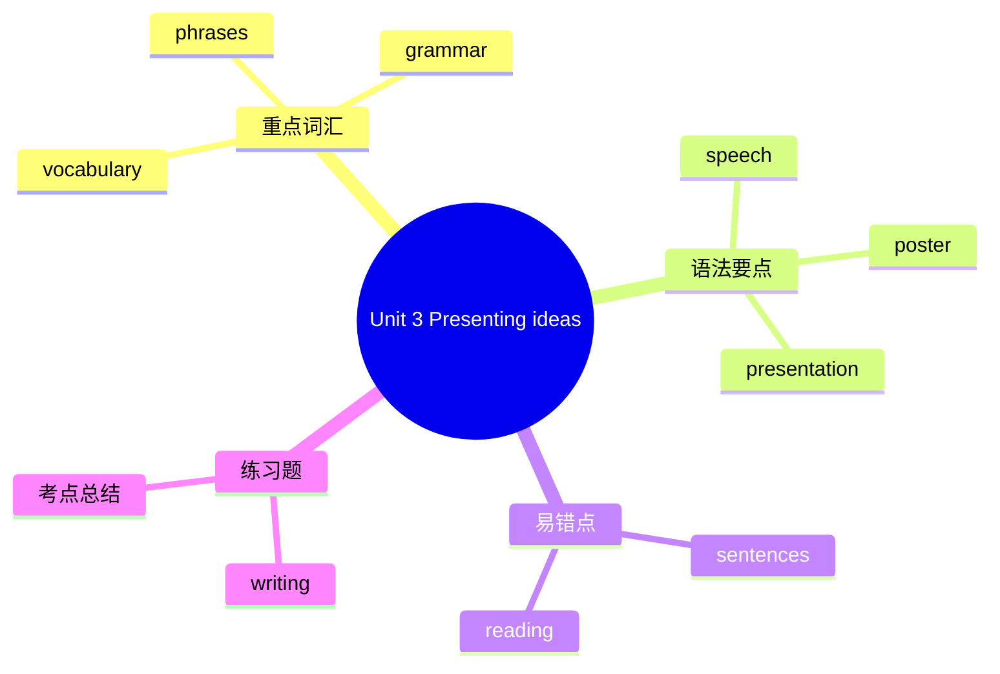

# Unit 3 Presenting ideas

标签：#Unit3 #PresentingIdeas #我的梦想 #演讲输出

## 一、课文精讲

Presenting ideas 是 Unit 3 的综合输出板块。学生需要围绕"Make it happen!"主题，完成一次个人展示，例如制作"我的梦想"海报、写一篇演讲稿或录制一段短视频。本环节强调把计划和梦想用清晰、有逻辑的语言表达出来。

展示内容通常包括：我的梦想是什么？我为什么有这个梦想？我打算如何实现它？我会遇到哪些困难？我准备怎样克服？使用 First, Next, Then, Finally 等顺序词可以让表达更有条理。

## 二、重点词汇

- **speech** n. 演讲  **poster** n. 海报
- **presentation** n. 展示  **audience** n. 观众
- **dream job** 梦想职业  **life goal** 人生目标
- **reason** n. 原因  **purpose** n. 目的
- **overcome** v. 克服  **difficulty** n. 困难
- **believe in** 相信  **work towards** 努力实现
- **come true** 实现  **make it happen** 让它实现

## 三、语法要点

**演讲稿常用句型**

1. 开场：Good morning, everyone. Today I'd like to talk about my dream.
2. 表达梦想：My dream is to become a / an ... / I've always wanted to be a / an ...
3. 表达计划：To make my dream come true, I'm going to ... / I plan to ... / I hope to ...
4. 说明原因：The reason is that ... / I want to ... because ...
5. 结尾：I believe my dream will come true if I keep trying. Thank you!

**be going to 与 will 在演讲中的选择**

- 讲已制定的计划用 be going to：I'm going to read one English book every month.
- 讲决心或预测用 will：I will never give up. / I believe I will succeed.

## 四、易错点

1. would like to 后接动词原形，不可接 -ing：I'd like to **be** a doctor.
2. reason 后接 that 从句或 for doing：The reason **is that** I love helping people. / The reason **for** my choice is clear.
3. dream of 后接 doing：I dream of **becoming** a scientist.

## 结构图示

## 五、练习题

1. 单项选择：My dream is ______ a teacher in the future.（A. become  B. to become  C. becoming）
2. 连词成句：going / am / I / to / every day / English / practise / because / I / want / to / abroad / study (.)
3. 改错：I believe my dream will comes true if I work hard.
4. 写作：以 "My Dream" 为题，写一篇 80 词左右的演讲稿。

**答案**：1. B  2. I am going to practise English every day because I want to study abroad.  3. comes → come  4. （略）

相关：[[Starting out]] ｜ [[Understanding ideas]] ｜ [[Developing ideas]] ｜ [[Reflection]]
