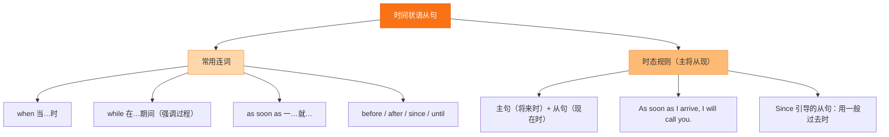

# Unit 3 Reflection

标签：#Unit3 #Reflection #单元复习 #未来规划

## 一、课文精讲

Reflection 是 Unit 3 *Make it happen!* 的总结与反思板块。本环节要求学生回顾整个单元围绕"梦想与计划"所学的内容，包括表达未来打算的 be going to、描述目标的相关词汇、时间状语从句以及演讲写作技巧。

通过自评表，学生可以检查自己是否达成了以下目标：能听懂并理解他人的梦想与计划；能用 be going to 表达自己的打算；能用 when/before/after 等连接词组织句子；能完成一篇关于梦想的口头或书面展示。

## 二、重点词汇

- **dream** n./v. 梦想  **goal** n. 目标
- **plan** n./v. 计划  **future** n. 将来
- **career** n. 职业  **scientist / doctor / teacher / engineer**
- **achieve** v. 实现  **success** n. 成功
- **practise** v. 练习  **improve** v. 提高
- **effort** n. 努力  **challenge** n. 挑战
- **come true** 实现  **give up** 放弃
- **try one's best** 尽某人最大努力  **grow up** 长大

## 三、语法要点

**Unit 3 核心语法网络**

1. **be going to 表示计划/打算/有迹象的预测**：
   - I'm going to learn French next term.
   - Look! It's going to rain.
2. **will 表示临时决定或客观将来**：
   - I'll help you with your homework.
3. **时间状语从句"主将从现"**：
   - When I grow up, I'm going to be a pilot.
   - After I finish school, I will travel around China.
4. **表达意愿的结构**：want to / hope to / plan to / would like to + 动词原形

## 四、易错点

1. be going to 后接动词原形，且 be 动词要与主语一致。
2. 时间状语从句中用一般现在时表将来：When he **leaves** school, he is going to study medicine.
3. dream of / about 后接 doing；hope 后接 to do 或 that 从句。

## 结构图示

## 五、练习题

1. 综合填空：
   - I ______ (go) to visit the science museum this Saturday.
   - She hopes ______ (become) a doctor when she ______ (grow) up.
   - ______ you ______ (work) harder next term?
2. 句型转换：I'm going to study abroad.（对 study abroad 提问）
3. 写作：制定一份"新学期计划"，至少包含三条具体打算和实现步骤，80 词左右。

**答案**：1. am going; to become; grows; Are; going to work  2. What are you going to do?  3. （略）

相关：[[Starting out]] ｜ [[Understanding ideas]] ｜ [[Developing ideas]] ｜ [[Presenting ideas]]
