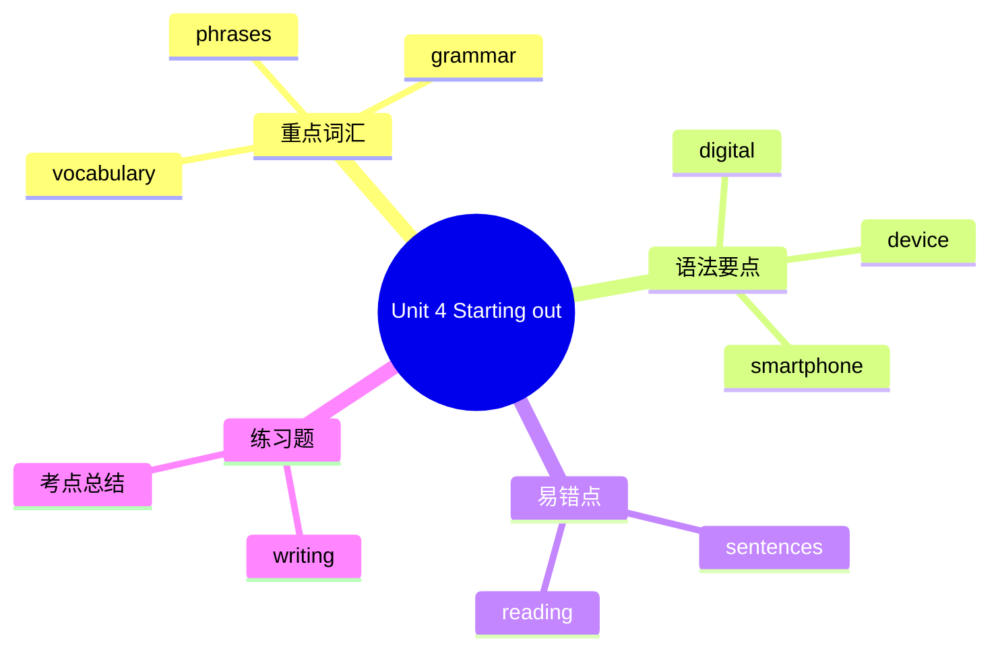

# Unit 4 Starting out

标签：#Unit4 #StartingOut #数字生活 #比较级

## 一、课文精讲

Starting out 是 Unit 4 *Digital life* 的导入环节。教材通过图片、视频和调查问卷，引导学生讨论"数字技术如何改变我们的生活"。本环节重点激活与"数字设备"和"网络活动"相关的词汇，如 smartphone, computer, app, Internet 等，并初步接触形容词比较级。

课堂活动常包括：列举日常使用的电子设备；讨论人们使用网络的不同方式；用 "more / less / fewer" 比较线上与线下生活的差异。

## 二、重点词汇

- **digital** adj. 数字的  **device** n. 设备
- **smartphone** n. 智能手机  **tablet** n. 平板电脑
- **laptop** n. 笔记本电脑  **screen** n. 屏幕
- **app** n. 应用程序  **website** n. 网站
- **Internet** n. 互联网  **online** adj./adv. 在线的/地
- **offline** adj./adv. 离线的/地  **social media** 社交媒体
- **text message** 短信  **video call** 视频通话
- **search for** 搜索  **chat with** 与……聊天

## 三、语法要点

**形容词比较级初步**

比较级用于两者之间的比较，常与 than 连用。

- 单音节词 + -er：fast → **faster**；cheap → **cheaper**
- 以 e 结尾 + -r：nice → **nicer**；large → **larger**
- 辅音 + y 结尾变 y 为 i + -er：easy → **easier**；happy → **happier**
- 重读闭音节双写尾字母 + -er：big → **bigger**；hot → **hotter**
- 多音节词前加 more：important → **more important**；popular → **more popular**

例句：A smartphone is **more convenient** than a traditional phone.

## 四、易错点

1. 比较级常与 than 连用，不可漏掉：❌ *This phone is more expensive.*（不完整）→ ✅ This phone is **more expensive than** that one.
2. 以 -y 结尾的形容词变比较级要变 y 为 i：❌ *more easy* → ✅ **easier**
3. good / bad 的比较级是不规则变化：good → **better**；bad → **worse**

## 结构图示

## 五、练习题

1. 写出下列词的比较级：
   - fast → ______  - easy → ______  - important → ______  - good → ______
2. 单项选择：Reading online is ______ than reading paper books for me.（A. more convenient  B. convenienter  C. more convenienter）
3. 汉译英：智能手机让我们的生活比以前更便捷。

**答案**：1. faster; easier; more important; better  2. A  3. Smartphones make our life more convenient than before.

相关：[[Understanding ideas]] ｜ [[Developing ideas]] ｜ [[Presenting ideas]] ｜ [[Reflection]]
