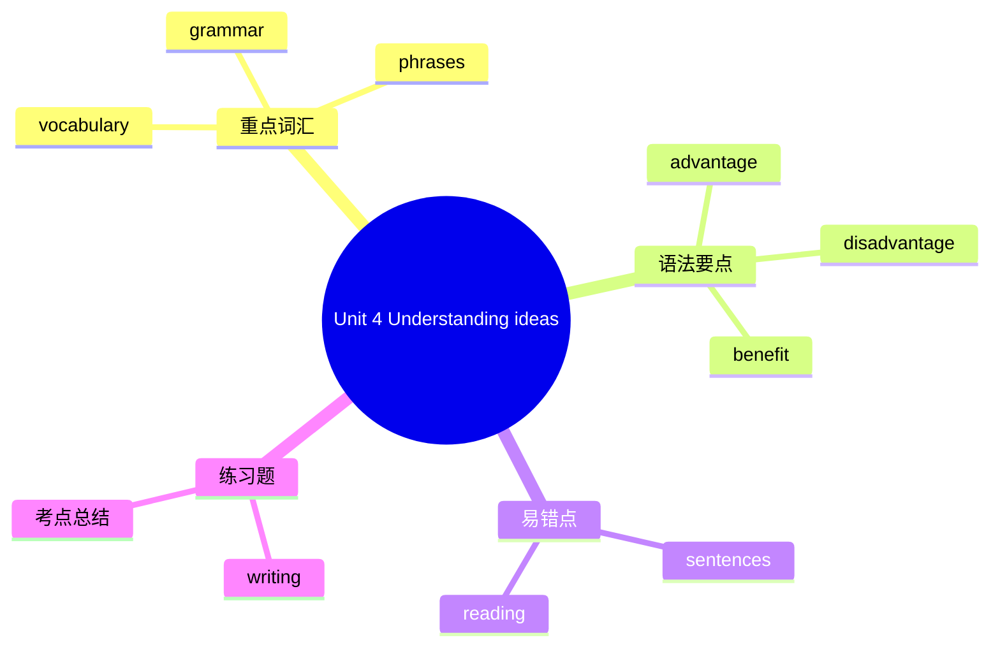

# Unit 4 Understanding ideas

标签：#Unit4 #UnderstandingIdeas #阅读理解 #数字生活

## 一、课文精讲

Understanding ideas 是 Unit 4 的主阅读板块。课文通常围绕"数字生活的利与弊"展开，讨论青少年使用电子设备、社交媒体和网络的现状。阅读时要关注作者的观点、论据以及文中使用比较级表达的不同看法。

阅读策略：先读标题预测文章是支持还是批评数字生活；找出文中表示比较的句子（more than, less than, as ... as）；总结"优点"与"缺点"两方面的信息；判断作者的最终态度。

## 二、重点词汇

- **advantage** n. 优点  **disadvantage** n. 缺点
- **benefit** n. 好处  **risk** n. 风险
- **convenient** adj. 方便的  **inconvenient** adj. 不便的
- **popular** adj. 受欢迎的  **necessary** adj. 必要的
- **addicted** adj. 上瘾的  **be addicted to** 对……上瘾
- **information** n. 信息  **knowledge** n. 知识
- **communicate** v. 交流  **connection** n. 联系
- **face to face** 面对面  **stay in touch** 保持联系

## 三、语法要点

**形容词比较级的完整用法**

1. **A + be + 比较级 + than + B**：
   - Online shopping is **cheaper than** shopping in stores.
2. **比较级 + and + 比较级**（越来越……）：
   - Life is becoming **easier and easier**.
3. **the + 比较级 ..., the + 比较级 ...**（越……越……）：
   - **The more** you practise, **the better** you will be.
4. **less + 多音节形容词 + than**（不如……）：
   - This app is **less useful than** that one.

**常用修饰比较级的词**：much, a little, even, far
- This phone is **much more expensive** than mine.

## 四、易错点

1. 比较级前加 more 还是 -er 不可重复：❌ *more easier* → ✅ **easier**
2. 比较对象要一致：❌ *The screen of this phone is bigger than that phone.* → ✅ The screen of this phone is bigger than **that of** that phone.
3. less 后接多音节形容词原级：❌ *less easier* → ✅ **less easy**

## 结构图示

## 五、练习题

1. 用所给词适当形式填空：
   - This computer is ______ (expensive) than that one.
   - Living in the countryside is ______ (peaceful) than living in the city.
2. 单项选择：The ______ you use your phone, the ______ your eyes will be.（A. more; worse  B. more; worst  C. most; worse）
3. 句型转换：Reading e-books is convenient. Reading paper books is convenient, too.（合并为比较句）
4. 汉译英：网络让我们的生活变得越来越便捷。

**答案**：1. more expensive; more peaceful  2. A  3. Reading e-books is as convenient as reading paper books. / Reading e-books is more convenient than reading paper books.  4. The Internet is making our life more and more convenient.

相关：[[Starting out]] ｜ [[Developing ideas]] ｜ [[Presenting ideas]] ｜ [[Reflection]]
