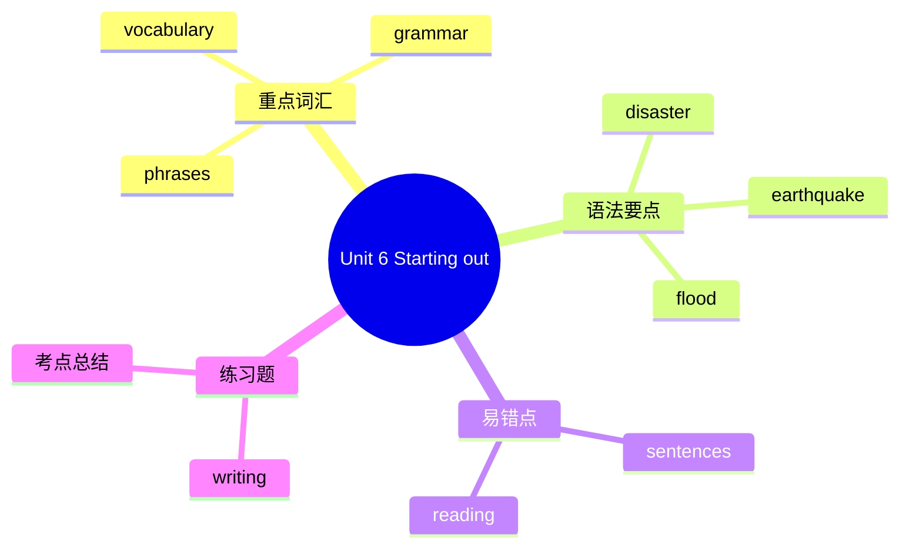

# Unit 6 Starting out

标签：#Unit6 #StartingOut #自然灾害 #过去进行时

## 一、课文精讲

Starting out 是 Unit 6 *When disaster strikes* 的导入环节。教材通过图片、视频和新闻报道片段，引导学生认识常见的自然灾害，如地震、洪水、台风、火灾等，并学习相关的英语表达。本环节重点激活灾害词汇，并初步接触过去进行时，为阅读灾难故事做准备。

课堂活动常包括：识别不同类型的灾害图片；讨论身边发生过的极端天气或事故；用 "What were you doing when ...?" 分享自己的经历。

## 二、重点词汇

- **disaster** n. 灾难  **natural disaster** 自然灾害
- **earthquake** n. 地震  **flood** n. 洪水
- **typhoon** n. 台风  **hurricane** n. 飓风
- **fire** n. 火灾  **drought** n. 干旱
- **storm** n. 暴风雨  **lightning** n. 闪电
- **thunder** n. 雷  **rainstorm** n. 暴雨
- **accident** n. 事故  **emergency** n. 紧急情况
- **danger** n. 危险  **safe** adj. 安全的

## 三、语法要点

**过去进行时初步**

过去进行时表示过去某一时刻或某段时间正在进行的动作。结构为：**was / were + doing**。

- 肯定句：I **was doing** my homework at 8 p.m. yesterday.
- 否定句：They **weren't watching** TV when I called.
- 一般疑问句：**Were** you **sleeping** at that time? — Yes, I was. / No, I wasn't.

**was / were 的使用**：

- I / he / she / it / 单数名词用 was
- you / we / they / 复数名词用 were

## 四、易错点

1. 过去进行时中 be 动词要用过去式 was/were，不可用 am/is/are：❌ *I am doing ... yesterday.* → ✅ I **was doing** ... yesterday.
2. 注意 doing 的拼写：run → running；sit → sitting；sleep → sleeping。
3. 表示"昨天某个具体时间"用 at + 时间点，常与过去进行时连用。

## 结构图示

## 五、练习题

1. 用所给词适当形式填空：
   - What ______ you ______ (do) at 9 o'clock last night?
   - My mother ______ (cook) dinner when I got home.
2. 单项选择：They ______ a football match at 4 p.m. yesterday.（A. watched  B. were watching  C. are watching）
3. 汉译英：地震发生时，我正在教室里上课。

**答案**：1. were; doing; was cooking  2. B  3. I was having a class in the classroom when the earthquake happened.

相关：[[Understanding ideas]] ｜ [[Developing ideas]] ｜ [[Presenting ideas]] ｜ [[Reflection]]
