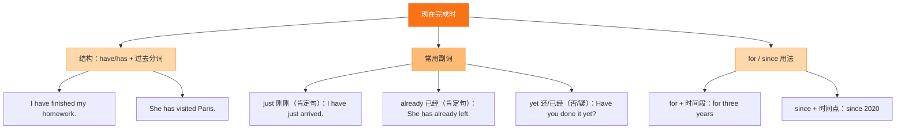

# Unit 1 Has it arrived yet?

标签：#Module3 #现在完成时 #just/already/yet #航天

## 一、课文精讲

本单元是 Module 3 Journey to space 的听说课。大明和 Tony 谈论刚发射的火星探测器：它到达火星了吗（Has it arrived yet?）。对话围绕最新的太空新闻展开，集中呈现现在完成时与 **just, already, yet** 连用表示"最近发生的事"。

听对话时注意三个副词的位置与含义：just（刚刚）、already（已经）用于肯定句，放 have/has 之后；yet（还；已经）用于否定句和疑问句，放句末。

关键句：
- **Has** the spacecraft **arrived yet**? 宇宙飞船到了吗？
- It **has just landed** on Mars. 它刚刚登陆火星。
- Scientists **have already received** the message. 科学家们已经收到了信息。

## 二、重点词汇

- **spacecraft** n. 宇宙飞船  **astronaut** n. 宇航员
- **space** n. 太空  **Mars** n. 火星
- **land** v. 着陆  **reach** v. 到达
- **news** n.（不可数）新闻  **model** n. 模型
- **just** adv. 刚刚  **already** adv. 已经
- **yet** adv. 还；已经（否/疑）  **so far** 到目前为止
- **take photos** 拍照  **go online** 上网

## 三、语法要点

**现在完成时（二）：just / already / yet**

- **just**：刚刚。The plane **has just taken off**.
- **already**：已经（肯定句）。We **have already finished** the work.
- **yet**：句末，用于否定句（还没）和疑问句（已经）。
  - I haven't finished my homework **yet**.
  - Have you had lunch **yet**?

**位置口诀**：just / already 居中（have 后），yet 收尾。

## 四、易错点

1. ❌ I have finished it **yet**. → ✅ **already**（肯定句用 already）
2. ❌ **Already** have you seen it? → ✅ Have you seen it **yet / already**?
3. news 不可数：a piece of **news**（❌ a news）
4. reach 是及物动词，直接接地点：reach Mars（❌ reach to Mars）

## 结构图示

## 五、练习题

1. 单项选择：— Has Tony come back ______? — Yes, he has ______ arrived.（A. yet; just  B. just; yet  C. already; yet）
2. 用所给词适当形式填空：
   - The spacecraft has just ______ (land) on the moon.
   - We haven't heard the news ______ (yet / already).
3. 改为否定句：They have already taken photos of Mars. → They ______ taken photos of Mars ______.
4. 汉译英：宇宙飞船已经到达火星了吗？——还没有。

**答案**：1. A  2. landed; yet  3. haven't; yet  4. Has the spacecraft reached / arrived on Mars yet? — Not yet.

相关：[[Unit 2 We have not found life on any other planets yet]] ｜ [[Unit 3 Language in use]]
