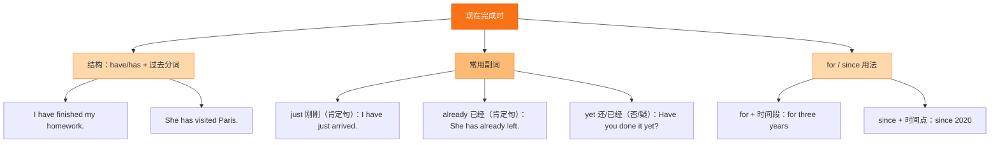

# Unit 3 Language in use

标签：#Module3 #语法总结 #现在完成时 #just/already/yet

## 一、课文精讲

本单元是 Module 3 的语法归纳课，重点巩固现在完成时与 **just, already, yet, so far** 连用的用法，并综合运用谈论太空知识。课堂活动包括：改写句子（肯定 ↔ 否定 ↔ 疑问）、听短文补全信息、根据提示介绍一次"太空新闻发布会"。

学完本单元要能：准确选择 already 与 yet；快速完成现在完成时的句式转换；用 5-6 句话介绍人类太空探索的成就。

句式转换示例：
- 肯定：The spacecraft **has already sent back** photos.
- 否定：The spacecraft **hasn't sent back** photos **yet**.
- 疑问：**Has** the spacecraft **sent back** photos **yet**?

## 二、重点词汇

- **project** n. 项目；工程  **information** n.（不可数）信息
- **satellite** n. 卫星  **technology** n. 技术
- **recently** adv. 最近  **however** adv. 然而
- **on one's own** 独自  **at the moment** 此刻
- **hundreds of** 数百的  **millions of** 数百万的
- **get information about** 获取关于……的信息

## 三、语法要点

**现在完成时用法小结（Module 2 + Module 3）**

1. 表经历：ever, never, once, twice — I have **never** seen a UFO.
2. 表最近完成/结果：just, already, yet — He has **just** come back.
3. 表迄今成果：so far, recently — **So far** we have learned 500 words.

**数词 + hundred/thousand/million 不加 s**；表约数时用 hundreds of / millions of：
- three **hundred** students / **hundreds of** students

**however 与 but**：however 更正式，可放句首且用逗号隔开。

## 四、易错点

1. information 不可数：much information（❌ many informations）
2. ❌ **Millions of** 后再加具体数字：millions of people ✅；three millions people ❌
3. 现在完成时不能与具体过去时间连用：❌ He has arrived yesterday.

## 结构图示

## 五、练习题

1. 单项选择：______ people have watched the launch on TV.（A. Two millions  B. Millions of  C. Million of）
2. 用所给词适当形式填空：
   - We have got lots of ______ (information) about Mars.
   - She has ______ (just) finished her project.
3. 句型转换：They have already discovered a new planet.（改一般疑问句）→ ______ they ______ a new planet ______?
4. 汉译英：到目前为止，中国已经发射了数百颗卫星。

**答案**：1. B  2. information; just  3. Have; discovered; yet  4. So far, China has sent up / launched hundreds of satellites.

相关：[[Unit 1 Has it arrived yet?]] ｜ [[Unit 2 We have not found life on any other planets yet]]
