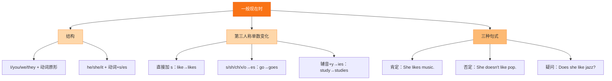

# Unit 1 It's time to watch a cartoon

标签：#Module5 #动画片 #听说课 #讲述故事

## 一、课文精讲

本单元是 Module 5 Cartoons 的听说课。Betty 和玲玲讨论看什么动画片（It's time to watch a cartoon），对话中谈到《美猴王》（the Monkey King）和其他经典卡通形象：孙悟空能七十二变、挥舞金箍棒，既聪明又勇敢，深受大家喜爱。

对话综合运用一般现在时描述卡通人物的特点与能力（can 句型），并出现 it's time to do sth.、come out 等常用表达。听时抓住"人物 — 外形 — 本领 — 受欢迎原因"四要素。

关键句：
- **It's time to** watch a cartoon. 该看动画片了。
- The Monkey King **can make** 72 changes to his shape and size. 美猴王会七十二变。
- He **fights** bad people **with** his magic stick. 他用金箍棒打坏人。

## 二、重点词汇

- **cartoon** n. 动画片；漫画  **film** n. 电影
- **stick** n. 棍棒  **magic** adj. 有魔力的
- **hero** n. 英雄（pl. heroes）  **humorous** adj. 幽默的
- **smart** adj. 聪明的  **brave** adj. 勇敢的
- **come out**（书/电影）出版；上映  **turn ... into ...** 把……变成……
- **it's time to do sth.** 该做某事了  **can't help doing** 忍不住做

## 三、语法要点

**it's time 句型**

- It's time **to do** sth.：It's time **to go** to school.
- It's time **for** + 名词：It's time **for lunch**.
- It's time for sb. to do sth.：It's time **for us to start**.

**can 表能力**：The Monkey King **can turn** himself into different animals.

**with 表工具/伴随**：He fights **with** a magic stick.（用金箍棒）

## 四、易错点

1. hero 复数加 es：hero**es**（同类：tomatoes, potatoes）
2. ❌ It's time **watching** TV. → ✅ It's time **to watch** TV.
3. come out 不用被动：The film **came out** last week.（❌ was come out）

## 结构图示

## 五、练习题

1. 单项选择：The new cartoon film ______ last month and children love it.（A. came out  B. was come out  C. comes out）
2. 用所给词适当形式填空：
   - The Monkey King can turn himself ______ (in) different animals.
   - These ______ (hero) are popular with children.
3. 同义句转换：It's time for supper. = It's time ______ ______ supper.
4. 汉译英：该看动画片了！美猴王又聪明又勇敢。

**答案**：1. A  2. into; heroes  3. to have/eat  4. It's time to watch a cartoon! The Monkey King is smart and brave.

相关：[[Unit 2 Tintin has been popular for over eighty years]] ｜ [[Unit 3 Language in use]]
