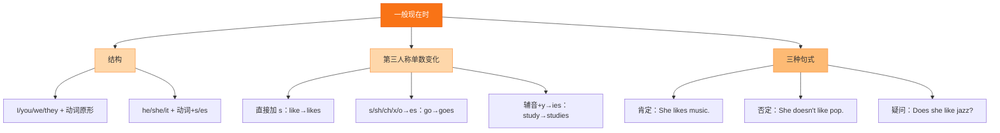

# Unit 3 Language in use

标签：#Module5 #语法总结 #现在完成时综合 #卡通介绍

## 一、课文精讲

本单元是 Module 5 的语法综合课，把前几个模块所学的现在完成时四类用法（经历 ever/never；完成 just/already/yet；延续 for/since；成果 so far）放在"介绍卡通形象"的语境中综合运用。课堂任务是写一篇介绍自己最喜欢的卡通人物的短文。

写作框架建议：
1. 开头：卡通名称、来自哪国、诞生多久（has been popular for...）。
2. 中间：外形、性格、本领（一般现在时 + can）。
3. 结尾：为什么喜欢（because...）。

关键句：
- I **have watched** this cartoon many times. 这部动画我看过很多遍。
- It **has been** my favourite **since** I was five. 从我五岁起它就是我的最爱。

## 二、重点词汇

- **fun** n. 乐趣  **funny** adj. 滑稽的
- **simple** adj. 简单的  **real** adj. 真实的
- **expect** v. 期待  **win the heart of** 赢得……的心
- **a bit** 有点  **be famous for** 因……而闻名
- **all around the world** 全世界  **make sb. laugh** 使某人发笑
- **so ... that ...** 如此……以至于……

## 三、语法要点

**现在完成时四大用法总表**

| 用法 | 标志词 | 例句 |
| --- | --- | --- |
| 经历 | ever, never, twice | Have you **ever** read Tintin? |
| 刚完成 | just, already, yet | I've **just** seen the film. |
| 延续 | for, since | It **has been** popular **for** 80 years. |
| 迄今成果 | so far | **So far** he has drawn 100 cartoons. |

**make sb. + 动词原形/形容词**：
- The cartoon **makes us laugh**. / It **makes me happy**.

## 四、易错点

1. ❌ The story makes me **to laugh**. → ✅ makes me **laugh**（省 to）
2. fun 名词（have fun），funny 形容词（a funny story），勿混用。
3. so...that 与 such...that：**so** funny that... / **such** a funny story that...

## 结构图示

## 五、练习题

1. 单项选择：The cartoon is ______ funny that everyone loves it.（A. so  B. such  C. very）
2. 用所给词适当形式填空：
   - Watching cartoons always makes me ______ (feel) relaxed.
   - He ______ (draw) more than 50 cartoons so far.
3. 改错：I have watched this film since two years. ______
4. 书面表达（4-5句）：用现在完成时至少两处，介绍你最喜欢的卡通人物。

**答案**：1. A  2. feel; has drawn  3. since → for  4. 示例：My favourite cartoon character is the Monkey King. He has been popular for many years. I have watched his stories many times since I was a child. He is brave and smart, and he always makes me laugh.

相关：[[Unit 1 It's time to watch a cartoon]] ｜ [[Unit 2 Tintin has been popular for over eighty years]] ｜ [[Revision module A]]
