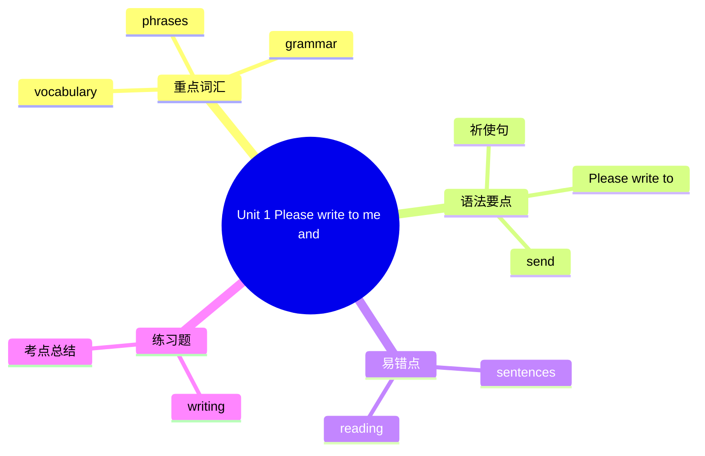

# Unit 1 Please write to me and send me some photos!

标签：#Module7 #听说课 #暑期夏令营 #祈使句

## 一、课文精讲

本单元是 Module 7 Summer in Los Angeles 的听说课。Betty 即将去洛杉矶参加暑期英语夏令营，朋友们纷纷叮嘱她：请给我写信、寄照片（Please write to me and send me some photos!）。对话围绕行前准备与联络方式展开，大量使用**祈使句**提出请求和建议。

听对话时记录：Betty 去哪里、做什么、朋友们各提出了什么请求。注意 remember to do（记得去做）与 forget to do（忘记去做）的用法。

关键句：
- **Please write to** me and **send** me some photos! 请给我写信并寄些照片！
- **Remember to** speak English all the time. 记得一直说英语。
- **Don't forget to** buy me a present! 别忘了给我买礼物！

## 二、重点词汇

- **airport** n. 机场  **passport** n. 护照
- **suitcase** n. 手提箱  **guidebook** n. 旅行指南
- **course** n. 课程  **camp** n. 夏令营
- **abroad** adv. 在国外  **light** adj. 轻的
- **write to sb.** 给某人写信  **remember to do** 记得做
- **forget to do** 忘记做  **arrive in/at** 到达
- **have a good trip** 旅途愉快

## 三、语法要点

**祈使句**

- 肯定：动词原形开头。**Open** your books. / **Please be** careful.
- 否定：Don't + 动词原形。**Don't forget** your passport.
- 加强语气可加 please（句首或句末）。

**remember / forget + to do vs. doing**

- remember **to do**：记得去做（未做）。Remember **to close** the door.
- remember **doing**：记得做过（已做）。I remember **seeing** him before.

**arrive in + 大地方 / arrive at + 小地方**：arrive **in** Los Angeles / arrive **at** the airport

## 四、易错点

1. ❌ Don't **to open** the window. → ✅ Don't **open**...（祈使句用原形）
2. ❌ write me（美式可用，但教材规范为）→ ✅ write **to** me
3. ❌ arrive **to** the city → ✅ arrive **in** the city / **reach** the city

## 结构图示

## 五、练习题

1. 单项选择：______ late for the English camp, or you'll miss the first class.（A. Don't be  B. Not be  C. Don't）
2. 用所给词适当形式填空：
   - Remember ______ (send) me an email when you arrive.
   - The plane arrived ______ (介词) the airport at 9 p.m.
3. 同义句转换：Don't forget to take your guidebook. = ______ ______ take your guidebook.
4. 汉译英：请给我写信，并给我寄一些洛杉矶的照片。

**答案**：1. A  2. to send; at  3. Remember to  4. Please write to me and send me some photos of Los Angeles.

相关：[[Unit 2 Fill out our form and come to learn English in Los Angeles!]] ｜ [[Unit 3 Language in use]]
