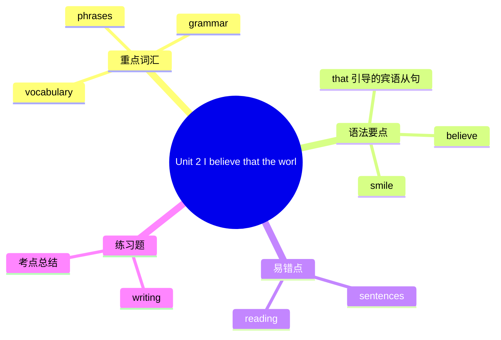

# Unit 2 I believe that the world is what you think it is

标签：#Module9 #阅读课 #友谊主题 #that宾语从句

## 一、课文精讲

本单元是 Module 9 的阅读课，一篇关于交友之道的文章。作者提出核心观点：我相信世界就是你所认为的样子（I believe that the world is what you think it is）——如果你觉得没人喜欢你、处处提防别人，你就交不到朋友；如果你以微笑待人、乐于助人，友谊自然会来。

文章用"问题—分析—建议"结构展开：先描述"感到孤独、没有朋友"的现象，再分析原因（态度消极），最后给出建议（主动微笑、参加活动、关心他人）。文中大量 **that 引导的宾语从句**表达观点。

关键句：
- I believe **that the world is what you think it is**. 我相信世界就是你所认为的样子。
- Some people think **that nobody likes them**. 有些人认为没人喜欢他们。
- Remember **that a smile can win friends**. 记住微笑能赢得朋友。

## 二、重点词汇

- **believe** v. 相信  **smile** n./v. 微笑
- **lonely** adj. 孤独的  **alone** adv. 独自
- **shy** adj. 害羞的  **active** adj. 积极的
- **nobody** pron. 没有人  **everybody** pron. 每个人
- **immediately** adv. 立刻  **probably** adv. 很可能
- **be kind to** 对……友好  **care about** 关心
- **take an interest in** 对……产生兴趣

## 三、语法要点

**that 引导的宾语从句**

- 放在 think, believe, hope, know, say, remember 等动词后，that 可省略：
- I believe **(that)** you are right.
- 从句用陈述语序，时态与主句呼应。

**think 的否定前移**

- 汉语说"我认为他不对"，英语习惯说 I **don't think** he is right.（否定放主句）

**lonely vs. alone**：lonely 孤独的（心理）；alone 独自（状态）。He lives **alone**, but he never feels **lonely**.

## 四、易错点

1. ❌ I think he **isn't** coming. → ✅ I **don't think** he is coming.
2. nobody 作主语谓语用单数：Nobody **wants** to be lonely.
3. that 从句时态：主句过去时，从句相应后退：He said (that) he **was** busy.

## 结构图示

## 五、练习题

1. 单项选择：I ______ she will come to my birthday party.（A. don't think  B. think not  C. not think）
2. 用所给词适当形式填空：
   - He believes that a smile ______ (make) people feel warm.
   - The old man lives ______ (lonely / alone), but he doesn't feel ______ (lonely / alone).
3. 合并句子：The world is a friendly place. I believe it. → I believe ______ the world ______ a friendly place.
4. 汉译英：记住：如果你对别人友好，你很可能会交到很多朋友。

**答案**：1. A  2. makes; alone, lonely  3. that; is  4. Remember that if you are kind to others, you will probably make many friends.

相关：[[Unit 1 Could I ask if you've mentioned this to her?]] ｜ [[Unit 3 Language in use]]
