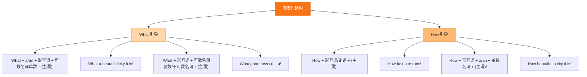

# Unit 1 It's more than two thousand years old

标签：#Module1 #世界奇观 #感叹句 #听说课

## 一、课文精讲

本单元是 Module 1 Wonders of the world 的听说课。对话发生在学校的 school magazine 会议上：Tony、Lingling、Betty 和 Daming 讨论"世界奇观"这个话题，各自提出自己心目中的自然奇观和人造奇观，如 the Giant's Causeway（巨人之路）、the Three Gorges Dam（三峡大坝）、Stonehenge（巨石阵）等。

对话中大家用一般过去时谈论参观经历，用感叹句表达赞叹，这两个语言点是本单元听说训练的重点。听对话时注意抓住"谁提名了哪个奇观、理由是什么"。

关键句：
- **What a good idea!** 多好的主意啊！
- It's **more than** two thousand years old. 它有两千多年的历史了。
- I **agree with** Betty. 我同意 Betty 的看法。
- **When did you visit** the Giant's Causeway? 你什么时候参观的巨人之路？

## 二、重点词汇

- **wonder** n. 奇迹；奇观  **band** n. 乐队
- **review** n. 评论；回顾  **ancient** adj. 古代的
- **composition** n. 作文  **grade** n. 成绩等级
- **pupil** n. 学生  **meeting** n. 会议
- **listen up** 注意听  **call sb. sth.** 称某人为……
- **agree with sb.** 同意某人（的看法）
- **more than** = over 超过；多于
- **join in** 参加（活动）  **get out of** 从……出来

## 三、语法要点

**感叹句（Exclamatory sentences）**

1. **What** 引导：What + (a/an) + 形容词 + 名词 (+ 主语 + 谓语)!
   - **What a good idea** (it is)! 
   - **What beautiful flowers** they are!（复数名词不加 a）
   - **What fine weather** it is!（不可数名词不加 a）
2. **How** 引导：How + 形容词/副词 (+ 主语 + 谓语)!
   - **How interesting** the story is!
   - **How fast** he runs!

判断技巧：先找中心词——中心词是**名词**用 What，是**形容词或副词**用 How。

## 四、易错点

1. ❌ **How** a clever boy he is! → ✅ **What** a clever boy he is!（中心词是名词 boy）
2. ❌ What a **useful** informations! → ✅ What useful information!（information 不可数，不加 a）
3. more than 后接数词表"超过"：more than 2,000 years ≠ 恰好两千年。
4. agree **with** sb. / agree **to** do sth.，介词不要混用。

## 结构图示

## 五、练习题

1. 单项选择：______ exciting news it is! We'll have a school trip next week.（A. What  B. What an  C. How  D. How an）
2. 单项选择：______ fast the boy runs!（A. What  B. What a  C. How  D. How a）
3. 完成句子：这座桥有五百多年的历史了。The bridge is ______ ______ five hundred years old.
4. 同义句转换：It is a very beautiful place. = ______ ______ beautiful place it is!
5. 汉译英：我同意你的看法，长城确实是一个奇迹。

**答案**：1. A（news 不可数）  2. C  3. more than  4. What a  5. I agree with you. The Great Wall is really a wonder.

相关：[[Unit 2]] ｜ [[Unit 3 Language in use]]
