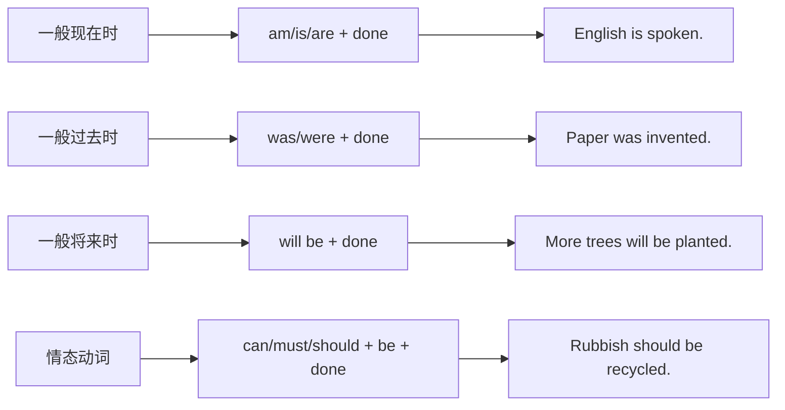

# Unit 3 Language in use

标签：#Module9 #语法整合 #被动语态大全 #发明话题

## 一、模块语法归纳

本单元整合 Module 9 Great inventions 的核心语法：**一般将来时被动语态**，并将初中阶段四种常考被动语态做系统总结，配合"发明"话题综合运用。

## 二、被动语态四时态总表（中考核心）

| 时态 | 结构 | 例句 |
| --- | --- | --- |
| 一般现在时 | am/is/are + done | English is widely spoken. |
| 一般过去时 | was/were + done | Paper was invented in China. |
| 一般将来时 | will be + done | A new library will be built. |
| 情态动词 | 情态 + be + done | E-books can be downloaded. |

**扩展**：现在完成时被动 have/has been done：Great changes **have been made** in my hometown.

## 三、主动改被动通用步骤

1. 找出主动句宾语 → 作被动句主语；
2. 动词按时态改为 be + 过去分词；
3. 原主语（如需强调）放 by 之后；
4. 检查主谓一致与人称代词格的变化。

例：They will send up more satellites. → More satellites **will be sent up** (by them).

## 四、发明话题表达库

- be invented/created by... 由……发明/创造
- change one's life 改变生活  **make life easier** 让生活更便利
- Thanks to..., ... 多亏了……
- play an important part/role in... 在……中起重要作用
- It is said that... 据说……

## 五、易错点

1. 四查被动句：查时态（be）、查分词（done）、查一致（主谓）、查介副词（短语动词不拆）。
2. send up 发射，被动为 be sent up；take away 拿走，被动为 be taken away。
3. 含双宾语的被动：Sb. be given sth. / Sth. be given to sb.
4. "据说"句型：It is said that... = People say that...

## 六、练习题

1. 单项选择：More trees ______ on the hill next spring.（A. will plant  B. will be planted  C. are planted  D. were planted）
2. 单项选择：The computer ______ to the Internet, so I can't search for anything now.（A. isn't connected  B. doesn't connect  C. wasn't connecting  D. won't connect）
3. 单项选择：Great changes ______ in our city since 2010.（A. took place  B. have taken place  C. have been taken place  D. were taken place）
4. 句型转换：People will use robots to do housework.（改被动）Robots ______ ______ ______ to do housework.
5. 汉译英：据说一座新的科技博物馆明年将在我们城市建成。

**答案**：1. B  2. A  3. B（take place 无被动）  4. will be used  5. It is said that a new science and technology museum will be built in our city next year.

相关：[[Unit 1]] ｜ [[Unit 2]]
