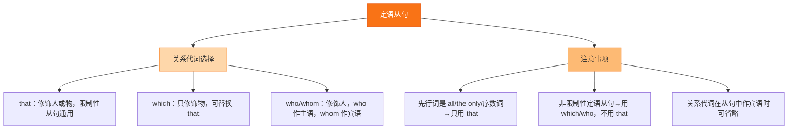

# Unit 3 Language in use

标签：#Module10 #语法整合 #定语从句 #国家介绍

## 一、模块语法归纳

本单元整合 Module 10 Australia 的核心语法：**that 引导的限制性定语从句**，梳理 that 在从句中作主语和宾语的用法，并积累介绍国家、地区的写作句式。

## 二、that 定语从句核心规则

**1. that 指人指物皆可**：
- The man **that** is talking to Miss Li is my father.（指人，作主语）
- The photos **that** you showed me are wonderful.（指物，作宾语）

**2. 作主语不可省，作宾语可省**：
- I like the koala **that lives** in the tree.（主语，不可省）
- The city (that) we visited last year is Sydney.（宾语，可省）

**3. 必须用 that 的情形**：
- 先行词被**最高级**修饰：the tallest building that...
- 先行词被**序数词**修饰：the first man that...
- 先行词被 all, only, any, no, every 等修饰：the only thing that...
- 先行词是**不定代词** something/anything/nothing/all。

## 三、国家介绍写作句式

- ...is a country that lies in... ……是位于……的国家
- It is famous for... 它以……闻名
- Most people live in..., while... 大多数人住在……，然而……
- The animals that you can only see there are... 只有在那里才能看到的动物是……
- If you go there, don't miss... 如果你去那里，别错过……

## 四、易错点

1. 关系代词 that 与 what 之辨：定语从句用 that（有先行词）；what 不能引导定语从句。
2. 从句谓语单复数看**先行词**：the students that **are**... / the student that **is**...
3. 从句中忌重复代词：❌ the city that I visited **it**。
4. 介词不能提到 that 之前（❌ in that），需要时用 which。

## 结构图示

## 五、练习题

1. 单项选择：The first thing ______ you should do is to read the instructions carefully.（A. which  B. who  C. that  D. what）
2. 单项选择：I can't find the pen ______ my father gave me last week.（A. who  B. it  C. that  D. what）
3. 单项选择：All ______ we need is enough time.（A. what  B. that  C. which  D. who）
4. 合并句子：The kangaroo is an animal. It can only be seen in Australia.（用 that 合并）
5. 汉译英：昨天我们参观的那个农场属于 Tony 的叔叔。

**答案**：1. C  2. C  3. B  4. The kangaroo is an animal that can only be seen in Australia.  5. The farm that we visited yesterday belongs to Tony's uncle.

相关：[[Unit 1]] ｜ [[Unit 2]]
