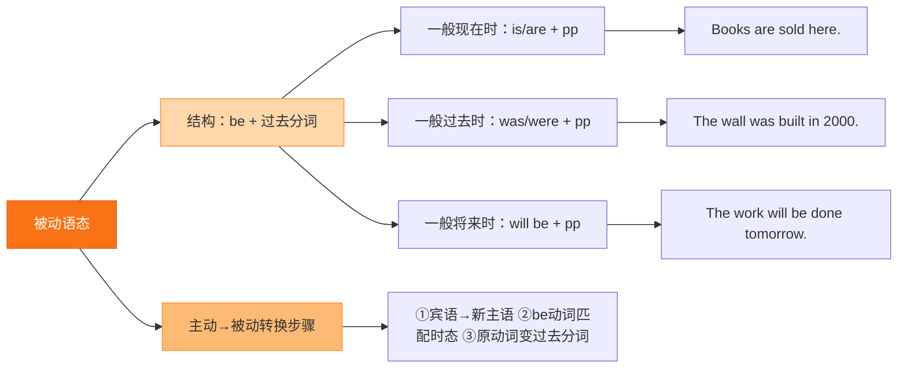

# Unit 2 The photo which we liked best was taken by Zhao Min

标签：#Module11 #比赛结果 #定语从句which #阅读课

## 一、课文精讲

本单元是 Module 11 的阅读课，课文是学校杂志刊登的**摄影比赛结果公告**：本次比赛共收到几百张参赛照片，评委从中评出获奖作品。文章逐一点评获奖照片——有的拍摄自然风光，有的记录人物瞬间，**我们最喜欢的那张照片是赵敏拍的**（The photo **which we liked best** was taken by Zhao Min），它捕捉到了运动员冲线时的精彩瞬间。文末公布颁奖安排。

文章将**定语从句（who/which/that）与被动语态**结合使用，是两大语法点的综合运用语篇，也是结果公告类应用文的范例。

关键句：
- The photo **which we liked best** was taken by Zhao Min. 我们最喜欢的照片是赵敏拍的。
- The prizes **will be given** to the winners next week. 奖品将于下周颁发给获奖者。
- Thanks to everyone **who took part in** the competition. 感谢每一位参赛者。

## 二、重点词汇

- **result** n. 结果  **winner** n. 获胜者
- **moment** n. 瞬间；时刻  **excellent** adj. 极好的
- **choice** n. 选择（choose v.）  **decision** n. 决定
- **local** adj. 当地的  **artist** n. 艺术家
- **make a choice** 做出选择  **at the moment** 此刻
- **first prize** 一等奖  **congratulations to** 向……祝贺
- **on show** 展出中  **thanks to** 感谢；多亏

## 三、语法要点

**which 引导的定语从句 + 与被动语态综合**

1. 先行词是**物**、关系代词作主语或宾语，用 which/that：
   - The photo **which won** first prize is wonderful.（主语）
   - The photo **which we liked** best...（宾语，可省略）
2. 定语从句与被动语态叠加：
   - The photos **that were sent in** by students are all good. 学生们寄来的照片都很好。
3. 先行词 + 定语从句作主语时，谓语与**先行词**一致：
   - The photo which we liked best **was** taken by Zhao Min.

## 四、易错点

1. 长句先找主干：The photo (which we liked best) **was taken** by Zhao Min. 括号内是修饰成分。
2. 从句作宾语时 which/that 可省略：The photo we liked best...
3. congratulations 恒用复数：**Congratulations** to all the winners!
4. thanks to（多亏）与 thanks for（因……而感谢）搭配不同。

## 结构图示

## 五、练习题

1. 单项选择：The photo ______ was taken by my brother won the first prize.（A. who  B. whom  C. which  D. whose）
2. 单项选择：The photos ______ the students sent in ______ on show now.（A. which; is  B. who; are  C. that; are  D. whom; is）
3. 完成句子：评委们最喜欢的那张照片拍的是日出。The photo ______ the judges liked best ______ of the sunrise.
4. 句型转换：Zhao Min took this photo last month.（改被动）This photo ______ ______ by Zhao Min last month.
5. 汉译英：向所有参加比赛的同学表示祝贺，奖品将在下周五颁发。

**答案**：1. C  2. C  3. which/that; was  4. was taken  5. Congratulations to all the students who took part in the competition. The prizes will be given out next Friday.

相关：[[Unit 1]] ｜ [[Unit 3 Language in use]]
