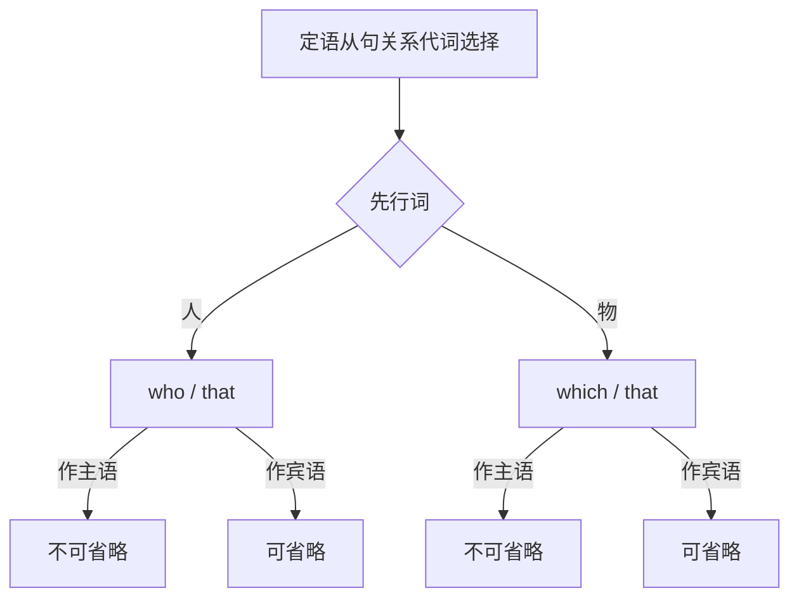

# Unit 3 Language in use

标签：#Module11 #语法整合 #定语从句总结 #关系代词

## 一、模块语法归纳

本单元整合 Module 11 Photos 的核心语法：**who / which / that 引导的限制性定语从句**全面总结，这是初中定语从句知识的收官整理，也是中考单选、语法填空的必考点。

## 二、关系代词选用总表

| 先行词 | 作主语 | 作宾语（可省） |
| --- | --- | --- |
| 人 | who / that | who / whom / that |
| 物 | which / that | which / that |

**只用 that 的场合**：
1. 先行词被最高级/序数词修饰：the best photo **that**...
2. 先行词被 all, only, no, any, every 修饰：the only one **that**...
3. 先行词是不定代词 something/anything/nothing/all。
4. 先行词既有人又有物：the people and the photos **that**...

**只用 who/which 的场合**：介词提前时（拓展）：the camera **with which** he took photos。

## 三、定语从句解题三步法

1. **找先行词**：人还是物？
2. **判断成分**：关系代词在从句中作主语还是宾语？
3. **查一致性**：从句谓语的数与先行词一致；从句不重复代词。

例：The boy ______ is taking photos is Tom.（先行词"人"+ 作主语 → who/that）

## 四、高频短语回顾

- win a prize / first prize 获奖  **take part in** 参加
- on show 展出  **at the same time** 同时
- make a choice/decision 做选择/决定  **be pleased with** 对……满意
- congratulations to sb. 祝贺某人  **thanks to** 多亏

## 五、易错点

1. what 永远**不引导**定语从句。
2. 先行词是 the one 指人时用 who：He is the one **who** helped me.
3. 定语从句避免与主句谓语混淆：先划掉从句再看主干。
4. 复合句逗号提示：限制性定语从句**不加逗号**。

## 六、练习题

1. 单项选择：I still remember the teachers and the things ______ helped me in the past three years.（A. who  B. which  C. that  D. whom）
2. 单项选择：The man ______ you talked with just now is a photographer.（A. which  B. whom  C. what  D. whose）
3. 单项选择：This is the most beautiful photo ______ I have ever seen.（A. which  B. that  C. who  D. what）
4. 语法填空：The girl ______ won the competition is only twelve years old.
5. 汉译英：我们参观的那个展览展出了当地艺术家拍摄的照片。

**答案**：1. C（人+物）  2. B  3. B（最高级修饰）  4. who/that  5. The exhibition (that) we visited showed photos (that were) taken by local artists.

相关：[[Unit 1]] ｜ [[Unit 2]]
