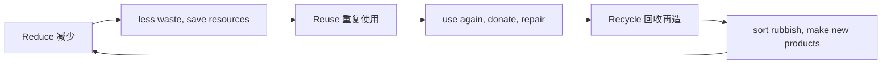

# Unit 2 Repeat these three words daily: reduce, reuse and recycle

标签：#Module12 #三R原则 #环保行动 #阅读课

## 一、课文精讲

本单元是 Module 12 的阅读课，课文是一篇倡导环保生活方式的说明文，中心思想是**每天牢记三个词：减少（reduce）、重复使用（reuse）、回收利用（recycle）**。文章分三部分具体展开：
- **Reduce**：少买不必要的东西，购物自带布袋，节约水电；
- **Reuse**：选择可以长期使用的物品，旧衣物、旧书捐赠他人继续使用；
- **Recycle**：垃圾分类投放，用回收材料制成新产品。

文章结构为"总—分—总"，每个分论点后紧跟具体做法，是**建议类/倡议类作文**的绝佳模板，中考书面表达高频套用。

关键句：
- **Repeat these three words daily**: reduce, reuse and recycle. 每天默念三个词：减量、重复利用、回收。
- **Don't buy** things **unless** you really need them. 除非真正需要，否则不要购买。
- Things **that are made of** paper, plastic or glass **can be recycled**. 纸质、塑料或玻璃制品可以回收。

## 二、重点词汇

- **repeat** v. 重复  **daily** adv. 每天 adj. 日常的
- **unless** conj. 除非 = if...not  **cloth** n. 布
- **glass** n. 玻璃  **metal** n. 金属
- **collect** v. 收集  **produce** v. 生产
- **be made of/from** 由……制成  **give away** 捐赠；分发
- **instead of** 代替  **throw away** 扔掉
- **use both sides of paper** 纸张双面使用
- **take one's own bag** 自带购物袋

## 三、语法要点

**unless 引导条件状语从句**

1. unless = if...not，"除非；如果不"：
   - Don't buy it **unless** you need it. = Don't buy it **if** you **don't** need it.
   - You'll miss the bus **unless** you hurry.
2. unless 从句同样遵循**主将从现**：
   - **Unless** it **rains**, we'**ll have** the picnic outside.

**be made of / from**
- be made **of**：看得出原材料（木桌 made of wood）；
- be made **from**：看不出原材料（纸 made from wood）。

## 四、易错点

1. unless 本身含否定，从句不再加 not：❌ unless you don't need it（双重否定致误）。
2. be made **of** glass（玻璃瓶）/ be made **from** grapes（葡萄酒）。
3. give away（捐出）与 give up（放弃）不可混。
4. daily 既是形容词（daily life）又是副词（repeat daily）。

## 五、练习题

1. 单项选择：You will be late ______ you leave immediately.（A. if  B. unless  C. when  D. because）
2. 单项选择：The desk is made ______ wood, and paper is also made ______ wood.（A. of; of  B. from; from  C. of; from  D. from; of）
3. 同义句转换：If you don't work hard, you won't pass the exam. = ______ you work hard, you won't pass the exam.
4. 完成句子：不要把旧书扔掉，可以把它们捐给别人。Don't ______ your old books ______. You can ______ them ______ to others.
5. 汉译英：除非我们现在采取行动减少污染，否则地球将处于危险之中。

**答案**：1. B  2. C  3. Unless  4. throw; away; give; away  5. Unless we take action to reduce pollution now, the earth will be in danger.

相关：[[Unit 1]] ｜ [[Unit 3 Language in use]]
