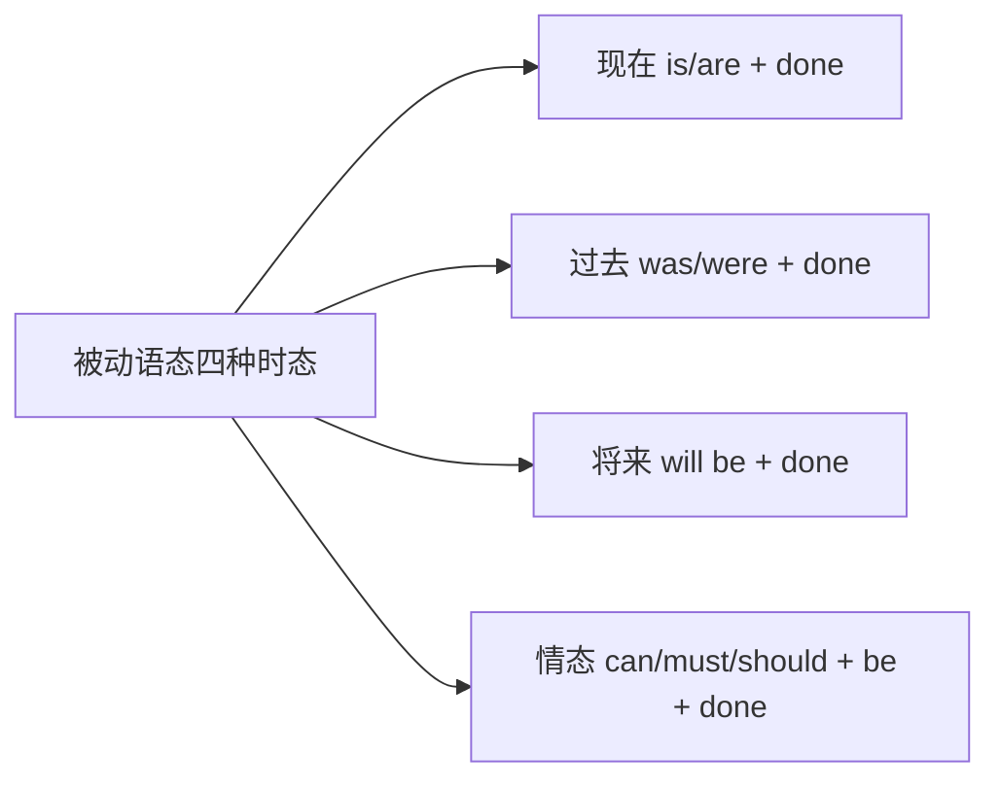
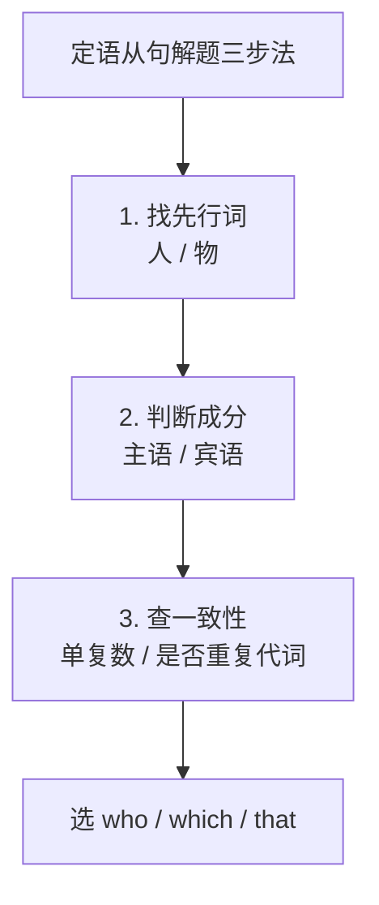

# Revision Module B

标签：#复习模块 #M7至M12 #语法总复习 #中考链接

## 一、复习范围

Revision Module B 综合复习 **Module 7 – Module 12** 的全部语言点，话题涵盖：伟大书籍、体育生活、伟大发明、澳大利亚、摄影比赛、拯救世界。语法主线是**被动语态**与**定语从句**两大九年级核心语法。

## 二、被动语态总复习

**四种常考形式**：

| 时态 | 结构 | 例句 |
| --- | --- | --- |
| 一般现在时 | is/are + done | The book is loved by readers. |
| 一般过去时 | was/were + done | He was chosen for the team. |
| 一般将来时 | will be + done | More satellites will be sent up. |
| 情态动词 | can/must/should be + done | Rubbish should be recycled. |

**要点**：不及物动词无被动；短语动词介副词不丢；双宾语两种被动形式。

## 三、定语从句总复习

1. 关系代词选用：指人 who/that；指物 which/that。
2. 作主语不可省略，作宾语可省略。
3. 只用 that：先行词含最高级、序数词、all/only/every/no，或为不定代词，或"人+物"。
4. 三步解题：找先行词 → 判成分 → 查一致。

## 四、条件与让步从句回顾

- if（如果）/ unless（除非）："主将从现"。
- although/though 不与 but 连用。
- so...that / such...that 结果状语从句。

## 五、话题短语速查

- be influenced by / be known as（M7） **break the record / be chosen for**（M8）
- be invented by / thanks to（M9） **belong to / be famous for**（M10）
- win a prize / on show（M11） **reduce, reuse, recycle / take action**（M12）

## 六、综合练习

1. 单项选择：The novel ______ by Mark Twain ______ by people all over the world.（A. written; is still loved  B. was written; still loves  C. written; still loved  D. wrote; is still loved）
2. 单项选择：He is the only student ______ was invited to the meeting.（A. which  B. who  C. that  D. whom）
3. 单项选择：______ we protect the wild animals, they will disappear from the earth.（A. If  B. Unless  C. Because  D. Although）
4. 单项选择：—Must I hand in the report today? —No, you ______. But it ______ before Friday.（A. mustn't; must finish  B. needn't; must be finished  C. can't; must be finished  D. needn't; must finish）
5. 语法填空：The photos ______ (take) in Australia last year will be shown at the exhibition ______ (hold) next month.
6. 书面表达（提纲）：以 "A Great Invention" 为题写 80 词短文：介绍一项发明（被动语态叙述发明时间与发明者）→ 它如何改变生活（定语从句）→ 展望未来（将来时被动）。

**答案**：1. A  2. C  3. B  4. B  5. taken; to be held/held  6. 略

相关：[[Unit 1]] ｜ [[Unit 3 Language in use]]
