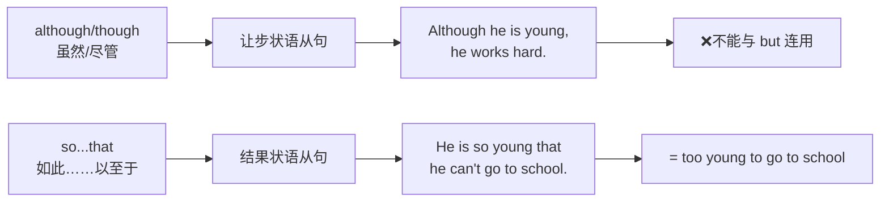

# Unit 3 Language in use

标签：#Module4 #语法整合 #让步状语从句 #结果状语从句

## 一、模块语法归纳

本单元整合 Module 4 Home alone 的两大语法：**although/though 引导的让步状语从句**和 **so...that 引导的结果状语从句**，并复习"独自在家"话题的常用表达。

## 二、让步状语从句复习

1. although/though 引导，"虽然……（但是……）"：
   - **Although** he is over sixty, he works as hard as young people.
2. 位置灵活：句首（后加逗号）或主句之后。
3. **禁配 but**，可配 still/yet：
   - Though it was raining, they **still** played outside.

## 三、结果状语从句复习

1. so + adj./adv. + that 从句：
   - She spoke **so quickly that** nobody understood her.
2. such + (a/an) (+adj.) + n. + that 从句：
   - It was **such a cold day that** we stayed at home.
3. **so/such 选择口诀**：so 修饰"形副"，such 修饰"名词"。
   - 特例：名词前有 many/much/few/little 修饰时用 so：**so many people**, **so much money**。
4. so...that（从句）与 too...to（短语）、enough to 的三者转换：
   - He is so strong that he can lift the box. = He is strong **enough to** lift the box.

## 四、重点短语回顾

- look after / take care of 照顾  **leave sb. alone** 不打扰某人
- be bored with 对……厌烦  **turn on/off** 开/关
- remember to do 记得去做  **make sure** 确保
- hand in 上交  **so far** 到目前为止

## 五、易错点

1. ❌ so many money → ✅ so **much** money（money 不可数）。
2. although 从句和 so...that 从句都不用"主将从现"规则约束——按实际时态。
3. too...to 本身含否定义，不再加 not。
4. that 结果状语从句不能省略 that 前面的 so/such。

## 六、练习题

1. 单项选择：______ the exam was difficult, most students passed it.（A. Because  B. Although  C. If  D. So）
2. 单项选择：There were ______ many people in the park ______ I couldn't find him.（A. so; that  B. such; that  C. so; as  D. such; as）
3. 同义句转换：The boy is too young to dress himself. = The boy is ______ young ______ he can't dress himself.
4. 单项选择：It was ______ weather that we decided to go for a picnic.（A. so fine  B. such fine  C. so a fine  D. such a fine）
5. 汉译英：虽然作业很多，但他还是帮妈妈做了家务。

**答案**：1. B  2. A  3. so; that  4. B（weather 不可数）  5. Although he had a lot of homework, he still helped his mother with the housework.

相关：[[Unit 1]] ｜ [[Unit 2]]
