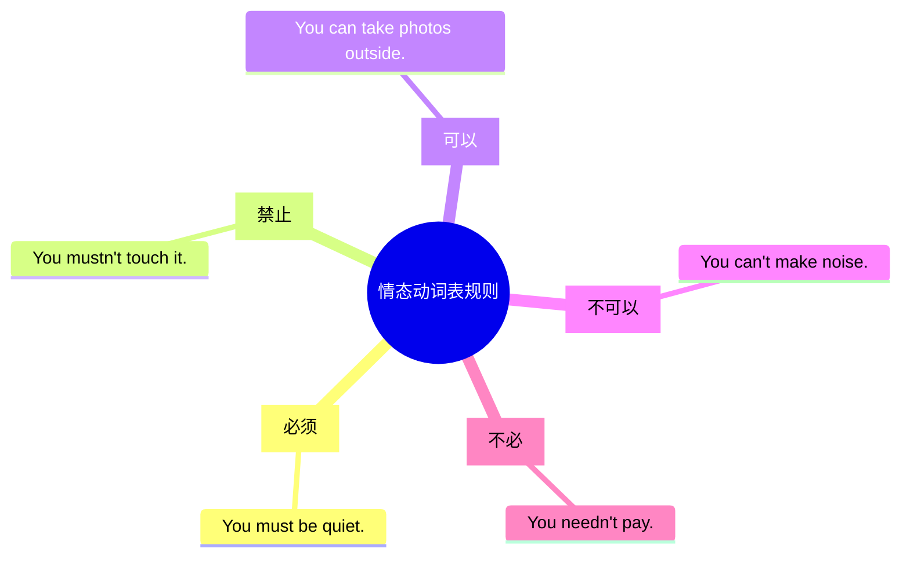

# Unit 3 Language in use

标签：#Module5 #语法整合 #情态动词 #条件状语从句

## 一、模块语法归纳

本单元整合 Module 5 Museums 的核心语法：**情态动词 must/mustn't/can/needn't 表规则**与 **if 条件状语从句**，并归纳博物馆参观、公共规则话题的表达。

## 二、情态动词表规则总表

| 情态动词 | 含义 | 例句 |
| --- | --- | --- |
| must | 必须 | You must be quiet. |
| mustn't | 禁止 | You mustn't smoke here. |
| can | 可以 | You can touch them. |
| can't | 不可以 | You can't park here. |
| needn't | 不必 | You needn't pay. |

- Must I...? → 肯定：Yes, you must. 否定：**No, you needn't.**
- have to 与 must：have to 客观需要，有时态变化（had to, will have to）。

## 三、if 条件句三种搭配

1. **主将从现**：If you **come**, I **will show** you around.
2. **主祈从现**：If you visit the museum, **don't touch** the exhibits.
3. **主(情态)从现**：If you like physics, you **can** do experiments here.

## 四、公共标识与规则表达

- No photos! 禁止拍照  No entry! 禁止入内
- Wet paint! 油漆未干  Keep off the grass! 勿踏草坪
- follow/obey the rules 遵守规则  break the rules 违反规则
- be allowed to do sth. 被允许做某事

## 五、易错点

1. mustn't（禁止）与 needn't（不必）辨析是中考必考点。
2. if 条件句从句**不能**用 will：❌ If it will snow...
3. 情态动词无人称变化：He **must**（❌ musts）。
4. must 表推测"一定"时的否定是 **can't**（不可能）：The light is off. He **can't** be at home.

## 六、练习题

1. 单项选择：—Must we clean the classroom now? —No, you ______. You can clean it after school.（A. mustn't  B. can't  C. needn't  D. won't）
2. 单项选择：If she ______ hard, she will pass the exam.（A. will study  B. studies  C. studied  D. study）
3. 单项选择：The sign on the wall says "No noise". It means we ______ make any noise.（A. can  B. needn't  C. mustn't  D. must）
4. 完成句子：如果明天不下雨，我们就去博物馆。If it ______ ______ tomorrow, we ______ ______ to the museum.
5. 汉译英：你不必买票，因为这个博物馆是免费的。

**答案**：1. C  2. B  3. C  4. doesn't rain; will go  5. You needn't buy a ticket because the museum is free.

相关：[[Unit 1]] ｜ [[Unit 2]]
