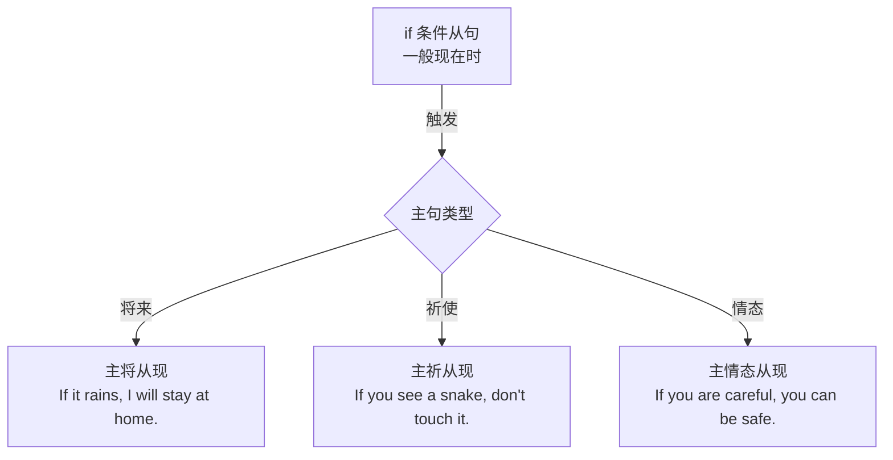

# Unit 3 Language in use

标签：#Module6 #语法整合 #if条件句 #疑问词加不定式

## 一、模块语法归纳

本单元整合 Module 6 Problems 的核心语法：**if 引导的条件状语从句**三种句式搭配、**疑问词 + 不定式**结构，以及提建议、谈问题的功能表达。

## 二、if 条件句三种搭配（总复习）

1. **主将从现**：If you leave rubbish everywhere, the city **will become** dirty.
2. **主祈从现**：If you see a snake, **don't touch** it.
3. **主(情态)从现**：If your computer breaks, you **can** get it repaired.

**if 从句时态口诀**：条件句里现在时，主句将来/祈使/情态随语境。

## 三、疑问词 + 不定式

1. 结构：what/which/how/where/when + to do，作宾语：
   - I don't know **what to do** next.
   - He can't decide **which one to buy**.
   - Can you tell me **how to get** to the museum?
2. 可与宾语从句互换：what to do = what I should do。

## 四、提建议与谈问题句型库

- What's the problem? / What's wrong (with...)?
- You'd better (not) do sth.
- Why not do sth.? / Why don't you do sth.?
- What about doing sth.? / How about doing sth.?
- If I were you, I would...（拓展）
- It's a waste to do sth. / It's a waste of + n.

## 五、易错点

1. if 从句忌用 will：❌ If it **will rain**... （宾语从句"是否"除外）。
2. Why not 后接**动词原形**；What about 后接**动名词**。
3. how to do 后不能再带宾语 it；用 what to do **with** it 表示"如何处理它"。
4. get sth. done 与 have sth. done 同义："请人做某事"。

## 六、练习题

1. 单项选择：—I don't know ______ next. —You can ask the teacher for help.（A. how to do  B. what to do  C. what should I do  D. how to do it next）
2. 单项选择：If he ______ to the party tomorrow, he ______ a good time.（A. comes; has  B. will come; will have  C. comes; will have  D. come; will have）
3. 单项选择：______ turning off the lights when you leave the room?（A. Why not  B. Why don't  C. What about  D. You'd better）
4. 完成句子：如果我们不保护环境，将来就会有更多问题。If we ______ ______ the environment, there ______ ______ more problems in the future.
5. 汉译英：我不知道如何处理这台旧电脑，你最好把它修好。

**答案**：1. B  2. C  3. C  4. don't protect; will be  5. I don't know what to do with the old computer. You'd better get it repaired.

相关：[[Unit 1]] ｜ [[Unit 2]]
