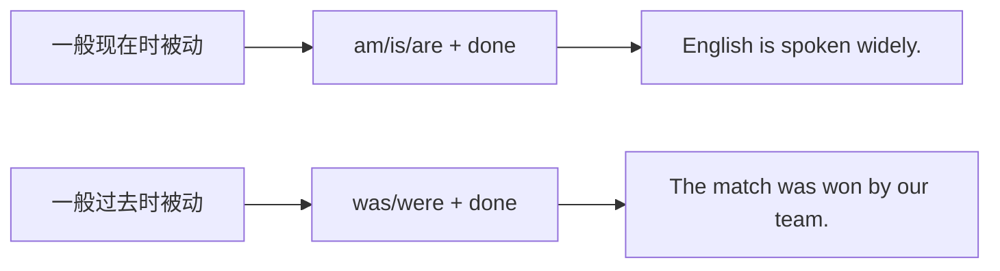

# Unit 3 Language in use

标签：#Module8 #语法整合 #被动语态 #体育话题

## 一、模块语法归纳

本单元整合 Module 8 Sports life 的核心语法：**一般过去时的被动语态**，并与一般现在时被动对比，同时归纳体育运动话题的高频词汇与句型。

## 二、两种时态被动语态对比

| 时态 | 结构 | 例句 |
| --- | --- | --- |
| 一般现在时被动 | am/is/are + done | Football is played all over the world. |
| 一般过去时被动 | was/were + done | The match was played yesterday. |

**转换练习示范**：
- People play basketball everywhere. → Basketball **is played** everywhere.
- They held the Olympics in 2008. → The Olympics **were held** in 2008.

## 三、被动语态使用要领

1. 及物动词才有被动；happen/take place 等不及物动词无被动。
2. 疑问句：**Was** the record **broken**? / **When was** the school built?
3. 含短语动词的被动，介/副词不丢：The game **was put off** because of the rain.
4. by 短语仅在需要强调执行者时保留。

## 四、体育话题表达库

- take up (a sport) 开始从事  **train hard** 刻苦训练
- be chosen for the team 入选球队  **cheer sb. on** 为某人加油
- win/lose a match 赢/输比赛  **beat + 对手** 战胜某队
- break/set a record 破/创纪录  **stay/keep fit** 保持健康
- Bad luck! / Keep trying! / You'll make it! 鼓励用语

## 五、易错点

1. 被动语态三查：查 be 的时态、查主谓一致、查过去分词形式。
2. ❌ The sports meeting **was taken place** last week. → ✅ **took place**。
3. win 后接比赛/奖项，beat 后接人/队伍。
4. 短语动词被动不拆分：be **looked after**, be **put off**。

## 六、练习题

1. 单项选择：The 2008 Olympic Games ______ in Beijing.（A. were holding  B. were held  C. held  D. was held）
2. 单项选择：—When ______ this school ______? —In 1985.（A. is; built  B. was; built  C. did; build  D. was; build）
3. 单项选择：The sports meeting ______ next week because of the bad weather.（A. will put off  B. will be put off  C. puts off  D. is put）
4. 句型转换：They didn't choose him for the team.（改被动）He ______ ______ for the team.
5. 汉译英：这场比赛正在被全世界数百万人观看。（拓展：现在进行时被动 is being watched）

**答案**：1. B  2. B  3. B  4. wasn't chosen  5. The match is being watched by millions of people around the world.

相关：[[Unit 1]] ｜ [[Unit 2]]
