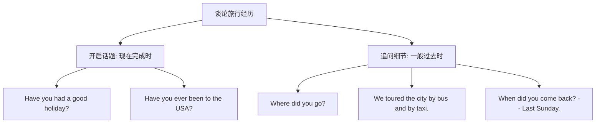

# Unit 1

标签：#Module1 #Travel #现在完成时与一般过去时 #听说课 ｜ 课文：We toured the city by bus and by taxi

## 一、课文精讲

本单元是 Module 1 Travel 的听说课。新年假期结束后，Betty、Daming 和 Tony 在学校互相询问假期旅行经历：Betty 一家去了美国，先飞到洛杉矶再去别处游玩；对话围绕"去了哪里、怎么去的、路上顺不顺利"展开，出现了 flight、take off、land 等一系列交通旅行词汇。

对话最核心的语言现象是：先用**现在完成时**引出经历（Have you had a good holiday?），再切换到**一般过去时**追问细节（Where did you go? We toured the city by bus and by taxi.）。"完成时开话题、过去时说细节"是北京中考听说与写作的高频套路。

关键句：
- **Have you had** a good New Year holiday? 新年假期过得好吗？
- We **toured** the city **by bus and by taxi**. 我们乘公交和出租车游览了这座城市。
- The plane **took off** late **because of** the fog. 因为大雾，飞机起飞晚点了。
- It was a long flight, but we **arrived in** Los Angeles safely.

## 二、重点词汇与短语

| 词汇 | 词性 | 释义 | 例句 |
| --- | --- | --- | --- |
| tour | v./n. | 游览；旅行 | We toured the city by bus. |
| flight | n. | 航班；飞行 | Our flight was late. |
| take off | 短语 | （飞机）起飞 | The plane took off at 8 a.m. |
| land | v. | 着陆；降落 | The plane landed safely. |
| over | adj. | 结束的 | The holiday is over. |
| direct | adj. | 直达的 | It's a direct flight to Beijing. |
| on time | 短语 | 准时 | The train arrived on time. |
| because of | 短语 | 因为（+名词） | We were late because of the rain. |

## 三、重点句型

1. **Have you ever been to...?** — Yes, I have. / No, I haven't.（询问经历）
2. **How long did it take** to get there? — It **took** us ten hours.
3. We went there **by plane / by train / on foot**.（交通方式）
4. The plane took off late **because of** the fog.（because of + 名词短语）

## 四、语法讲解：现在完成时 vs 一般过去时

- **现在完成时**（have/has + 过去分词）：强调过去动作对现在的影响或到目前为止的经历，不与具体过去时间连用。
- **一般过去时**：叙述发生在明确过去时间的动作，常与 yesterday、last week、two days ago 等连用。

判断口诀：句中有具体过去时间（yesterday / last... / ago / just now）必用过去时；说"到现在为止"的经历、结果（ever, never, yet, already, so far）用完成时。

## 五、易错点

1. ❌ I **have seen** the film last night. → ✅ I **saw** the film last night.（last night 是明确过去时间）
2. ❌ When **have you come** back? → ✅ When **did you come** back?（when 问具体时间点用过去时）
3. arrive **in** + 大地点（Los Angeles）；arrive **at** + 小地点（the airport）。
4. because 接从句，because of 接名词短语，不可混用。

## 六、背记要点

- 完成时结构：have/has + done；标志词 ever, never, just, already, yet, so far。
- 过去时标志词：yesterday, ago, last..., in + 过去年份, just now。
- 交通方式表达：by bus / by taxi / by plane = take a bus / a taxi / a plane。

## 七、自测题

1. 单选：—______ you ever ______ to the USA? —Yes, last year.（A. Did; go  B. Have; been  C. Have; gone  D. Do; go）
2. 单选：The plane ______ two hours ago.（A. has taken off  B. took off  C. takes off  D. is taking off）
3. 完成句子：我们乘公交和出租车游览了这座城市。We ______ the city ______ bus and ______ taxi.
4. 改错：I have visited my uncle last weekend.

**答案**：1. B  2. B  3. toured; by; by  4. have visited → visited

## 相关知识点

[[Unit 2]] ｜ [[Unit 3 Language in use]]
