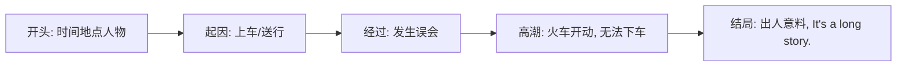

# Unit 2

标签：#Module1 #Travel #读写课 #叙事文 ｜ 课文：It's a long story.

## 一、课文精讲

本单元是 Module 1 Travel 的读写课。课文 It's a long story. 讲述了一段发生在火车上的趣事：一位乘客在火车即将开动时慌张地询问"这趟车去往哪里"，闹出了一场误会——原来他并不是要坐车，而是来送朋友的，结果车门关闭、火车开动，他被"带走"了。故事以幽默的对话推进，结尾出人意料。

文章文体为**记叙文**，按时间顺序叙述，通篇使用**一般过去时**，穿插直接引语。阅读时抓住"人物—地点—误会—结局"四要素；写作训练要求同学们模仿课文，用过去时写一段自己的旅行经历或旅途趣事，这正对应北京中考"叙事类"作文题型。

关键句：
- **It's a long story.** 说来话长。
- The train was **about to** leave. 火车马上就要开了。
- He **shouted** at the man, "You're on the wrong train!"
- **To his surprise**, the train started moving. 令他吃惊的是，火车开动了。

## 二、重点词汇与短语

| 词汇 | 词性 | 释义 | 例句 |
| --- | --- | --- | --- |
| crowded | adj. | 拥挤的 | The station was crowded. |
| couple | n. | 两个；一对 | I waited a couple of minutes. |
| sadness | n. | 悲伤 | She was full of sadness. |
| interview | v./n. | 采访；面试 | I interviewed the old man. |
| in a hurry | 短语 | 匆忙 | He left in a hurry. |
| be about to do | 短语 | 即将做某事 | The train was about to leave. |
| see sb. off | 短语 | 为某人送行 | I went to see my friend off. |
| to one's surprise | 短语 | 令某人惊讶的是 | To my surprise, he passed. |

## 三、重点句型

1. **It's a long story.** 说来话长。（口语常用应答）
2. The train **was about to** leave **when** the man jumped on.（be about to do... when... 正要……这时……）
3. He came to the station **to see his friend off**.（不定式表目的）
4. **To his surprise**, the door closed and the train moved.

## 四、叙事文写作结构

记叙文常用"背景—起因—经过—高潮—结局"的线索组织，谓语动词以一般过去时为主。

写作模板：Last summer, I went to... / When I was about to..., something unexpected happened. / To my surprise, ... / In the end, ...

## 五、易错点

1. be about to do 不与具体时间状语连用：❌ I was about to leave at 8:00 tomorrow.
2. see sb. off（送行）≠ see off sb.（代词必须放中间：see him off）。
3. a couple of + 复数名词：a couple of days，不是 a couple of day。
4. 叙事作文时态要统一为过去时，避免中途跳到现在时。

## 六、背记要点

- 三个"惊讶"表达：to one's surprise / in surprise / be surprised at。
- be about to do... when...：when 此处意为"正在这时"，不能换成 while。
- 叙事五要素：who, when, where, what, how。

## 七、自测题

1. 单选：I was ______ to leave when the phone rang.（A. about  B. around  C. away  D. able）
2. 单选：Tomorrow I'll go to the airport to ______ my uncle ______.（A. see; off  B. take; off  C. put; off  D. turn; off）
3. 完成句子：令我惊讶的是，他没赶上火车。______ my ______, he missed the train.
4. 汉译英：说来话长，我是在错误的站台上了车。

**答案**：1. A  2. A  3. To; surprise  4. It's a long story. I got on the train at the wrong platform.

## 相关知识点

[[Unit 1]] ｜ [[Unit 3 Language in use]]
