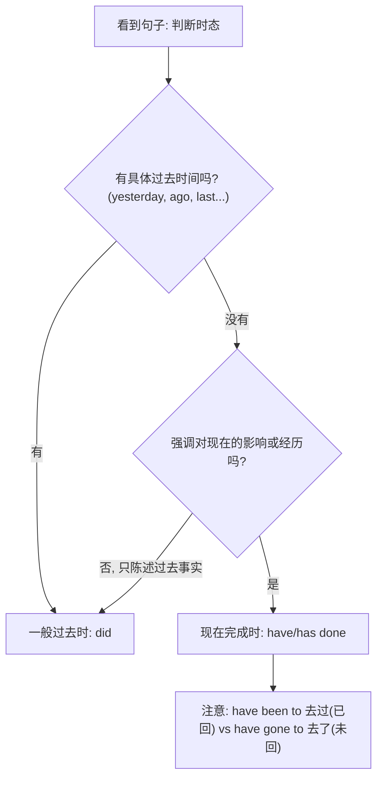

# Unit 3 Language in use

标签：#Module1 #语法总结 #现在完成时 #一般过去时

## 一、模块语法概览

本单元系统总结 Module 1 Travel 的核心语法：**现在完成时与一般过去时的区别与联用**。这是北京中考语法填空、单选和写作的必考点。两种时态都涉及"过去发生的动作"，区别在于视角：过去时只陈述过去的事实，完成时强调该动作与"现在"的联系（结果、影响、经历）。

## 二、语法讲解

### 1. 结构对比

| 项目 | 现在完成时 | 一般过去时 |
| --- | --- | --- |
| 结构 | have/has + 过去分词 | 动词过去式 |
| 含义 | 过去动作影响现在/经历 | 过去某时发生的动作 |
| 标志词 | ever, never, just, already, yet, so far, recently | yesterday, ago, last..., in 2020, just now |
| 例句 | I have finished my homework. | I finished it an hour ago. |

### 2. 判断流程

### 3. 三个高频细节

1. **have been to**（去过，人已回来）vs **have gone to**（去了，人不在此地）。
2. **短暂动词**（come, go, leave, buy, die, join）的完成时不能与"for + 时间段"连用，需转换：He has **been in** the army for 3 years.（≠ has joined ... for）
3. 特殊疑问词 **when** 引导的问句用过去时；**how long** 与延续性动词完成时连用。

## 三、句型转换训练

- 陈述 → 疑问：He has visited Beijing. → **Has he visited** Beijing?
- 完成时 → 过去时（补时间）：I have seen the film. → I **saw** the film **last week**.
- 短暂 → 延续：He bought the car two years ago. → He **has had** the car **for two years**.

## 四、易错点

1. ❌ He has gone to Shanghai twice. → ✅ He has **been** to Shanghai twice.（twice 表经历，人已回）
2. ❌ How long have you bought the bike? → ✅ How long have you **had** the bike?
3. ❌ I have finished it yesterday. → ✅ I finished it yesterday.
4. already 多用于肯定句，yet 多用于否定句和疑问句，位置在句末。

## 五、背记要点

- 完成时四大用法：经历（ever/never）、结果（already/just）、未完成（yet）、延续（for/since）。
- since + 时间点/过去时从句；for + 时间段。
- 常考短暂→延续转换：borrow→keep, buy→have, come→be here, die→be dead, leave→be away。

## 六、自测题

1. 单选：—Where is Mr. Li? —He ______ to Guangzhou.（A. has been  B. has gone  C. went  D. goes）
2. 单选：My uncle ______ this watch for ten years.（A. has bought  B. bought  C. has had  D. had）
3. 单选：—______ did you see him? —Two days ago.（A. How long  B. When  C. How often  D. How soon）
4. 语法填空：I ______ (visit) the Palace Museum three times so far.
5. 改错：She has left Beijing since 2021.

**答案**：1. B  2. C  3. B  4. have visited  5. has left → has been away from

## 相关知识点

[[Unit 1]] ｜ [[Unit 2]]
