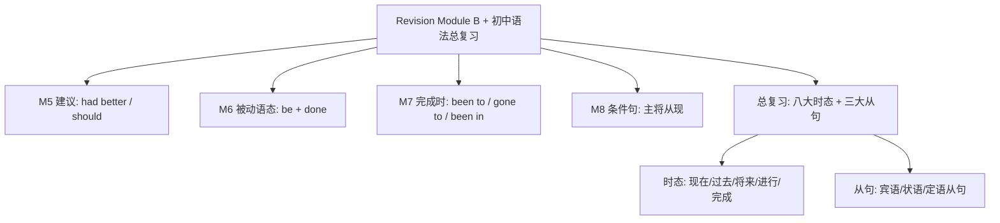

# Revision Module B

标签：#RevisionB #综合复习 #Module5至8 #初中语法总复习

## 一、复习范围概览

Revision Module B 综合复习 Module 5–8 的话题与语法：M5 Look after yourself（建议句型）、M6 Eating together（被动语态）、M7 English for you and me（现在完成时 have been to/gone to）、M8 My future life（条件状语从句与将来时）。作为九年级最后一个单元，它同时承担**初中语法总复习**功能，直接服务北京中考冲刺。

## 二、Module 5–8 语法回扣

1. **建议句型（M5）**：You'd better (not) do / should do / Why not do? / What about doing?——注意 had better 否定是 had better not do。
2. **被动语态（M6）**：be + 过去分词；一般现在 is/are done，一般过去 was/were done，情态动词 must be done；happen 等不及物动词无被动。
3. **现在完成时（M7）**：been to 去过已回，gone to 去了没回，been in + for/since；短暂动词延续化（join → be in）。
4. **条件状语从句（M8）**：主将从现；when/as soon as/until 同理；宾语从句的 if（是否）可用将来时。

## 三、初中核心语法清单（中考冲刺）

| 板块 | 核心要点 | 高频陷阱 |
| --- | --- | --- |
| 时态 | 八大时态标志词 | 完成时不接过去时间 |
| 被动 | be + done 随时态变 | 情态动词后勿丢 be |
| 宾语从句 | 一连二序三时态 | 陈述语序；客观真理 |
| 状语从句 | 主将从现 | if 从句不用 will |
| 定语从句 | that/which/who | 先行词是人/物的选择 |
| 比较等级 | -er than / the -est | very 不修饰比较级 |
| 情态动词 | must/needn't 应答 | Must...? No, needn't. |
| 非谓语 | enjoy doing / decide to do | 固定搭配记牢 |

## 四、易错点集中清查

1. ❌ The accident was happened last night. → ✅ happened（不及物无被动）。
2. ❌ If it will rain, we won't go. → ✅ If it rains...
3. ❌ He has gone to Beijing twice. → ✅ has been to（表经历）。
4. ❌ You'd better to rest. → ✅ You'd better rest.
5. ❌ Do you know when will the train leave? → ✅ when the train will leave（宾从陈述语序）。

## 五、背记要点

- 四大口诀连用：禁止 mustn't 不必 needn't；被动 be done 随时态；been to 已回 gone to 没回；主将从现记心间。
- 中考作文加分组合：一句完成时（经历）+ 一句条件句（展望）+ 一句被动（客观）+ 一句建议（劝告）。
- 话题词块四组：stay healthy / table manners / communicate with the world / dreams come true。

## 六、综合自测题

1. 单选：—Must I finish the paper now? —No, you ______. You can hand it in tomorrow.（A. mustn't  B. needn't  C. can't  D. shouldn't）
2. 单选：A new library ______ in our school last year.（A. builds  B. is built  C. was built  D. built）
3. 单选：—Where's Tom? —He ______ the teachers' office. He'll be back soon.（A. has been to  B. has gone to  C. has been in  D. had gone to）
4. 单选：If Lucy ______ free tomorrow, she will join us.（A. is  B. will be  C. was  D. be）
5. 单选：Could you tell me ______ the graduation ceremony?（A. when will we have  B. when we will have  C. when did we have  D. when do we have）
6. 语法填空：Chopsticks ______ (use) for eating in China for thousands of years.

**答案**：1. B  2. C  3. B  4. A  5. B  6. have been used

## 相关知识点

各模块语法详见 [[Unit 3 Language in use]]（M5–M8 语法总结篇）；前段复习见 [[Revision Module A]]。

