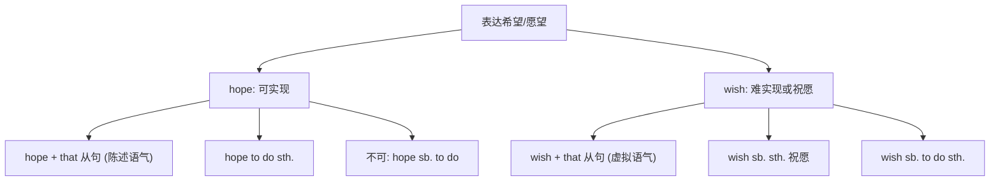

# Unit 1

标签：#Module2 #Education #宾语从句 #听说课 ｜ 课文：I hope we can have a match with them

## 一、课文精讲

本单元是 Module 2 Education 的听说课。话题围绕"中英学校交流"：Lingling 所在的学校与英国的一所学校结成友好学校，双方通过邮件和视频交流各自的校园生活。对话中同学们比较了中英学校在课程、课外活动、上学时间等方面的异同，并表达期望——I **hope** we can have a match with them.（我希望我们能和他们比一场。）

语言重点是 **hope / wish 引导的宾语从句**及两词的区别：hope 表示可实现的希望，后接从句或 to do；wish 表示难以实现的愿望（从句用虚拟）或"祝愿"（wish sb. sth.）。这是北京中考单选与写作中的常设考点。

关键句：
- I **hope (that) we can have** a match with them. 我希望我们能和他们比一场。
- I **hope to visit** your school one day. 我希望有一天参观你们学校。
- We **wish you success**! 我们祝你成功！
- Our school **is different from** yours **in** many ways.

## 二、重点词汇与短语

| 词汇 | 词性 | 释义 | 例句 |
| --- | --- | --- | --- |
| exchange | n./v. | 交流；交换 | We have an exchange programme. |
| accept | v. | 接受 | She accepted my invitation. |
| refuse | v. | 拒绝 | He refused to answer. |
| offer | v./n. | 提供；提议 | They offered us help. |
| term | n. | 学期 | The new term begins in March. |
| in person | 短语 | 亲自；本人 | I want to thank you in person. |
| be different from | 短语 | 与……不同 | My school is different from yours. |
| have a match with | 短语 | 与……比赛 | We had a match with Class 2. |

## 三、重点句型

1. I **hope (that)** + 从句：I hope we can win.（hope 不接 sb. to do）
2. I **hope to do** sth.：I hope to see you soon.
3. **wish sb. sth.**：Wish you good luck! / **wish to do**：I wish to join the club.
4. **What about doing...?** 提建议：What about writing to them first?

## 四、语法讲解：hope / wish 与宾语从句

宾语从句三要素（本模块初步接触，Unit 3 展开）：①连接词 that 可省略；②从句用**陈述语序**；③主句一般现在时，从句按需要选时态。

## 五、易错点

1. ❌ I hope **you to come** tomorrow. → ✅ I hope **(that) you can come** tomorrow.
2. wish sb. sth. 是双宾结构：Wish you a happy new year!（不用 hope）
3. hope 的答语：I hope so. / I hope not.（不说 I don't hope so.）
4. be different **from**，介词不用 with。

## 六、背记要点

- hope 两个搭配：hope to do / hope + that 从句。
- wish 三个搭配：wish to do / wish sb. to do / wish sb. + 名词。
- 交际功能句：I hope so. / I hope not. / What about...? / Why not...?

## 七、自测题

1. 单选：I hope ______ a match with the exchange students.（A. them to have  B. to have  C. having  D. have）
2. 单选：—Will it rain tomorrow? —I hope ______.（A. not  B. no  C. not so  D. so not）
3. 完成句子：祝你考试成功！______ you ______ in the exam!
4. 汉译英：我希望我们学校能与英国学校建立友好关系。

**答案**：1. B  2. A  3. Wish; success  4. I hope our school can build a friendly relationship with the British school.

## 相关知识点

[[Unit 2]] ｜ [[Unit 3 Language in use]]
