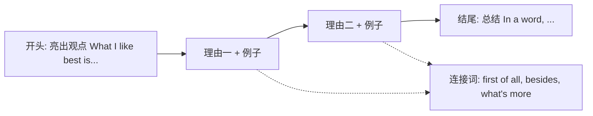

# Unit 2

标签：#Module2 #Education #读写课 #校园生活 ｜ 课文：What do I like best about school?

## 一、课文精讲

本单元是 Module 2 Education 的读写课。课文 What do I like best about school? 是几位英国学生谈"我最喜欢学校的什么"：有人喜欢和朋友相处的时光，有人喜欢某位老师的课，有人喜欢体育活动和学校设施，也有人坦言最喜欢的是"假期"。文章以第一人称多视角呈现，语言真实、口语化。

阅读技能训练点是**归纳每个人观点 + 找支撑细节**；写作任务是模仿课文写"我最喜欢学校的……并说明理由"，即北京中考常考的"校园生活类"话题作文。写作时建议采用"总—分—总"结构：先亮明观点，再给两三个理由和例子，最后总结。

关键句：
- **What I like best about school is** the friends I have made here. 我最喜欢学校的是我在这里交到的朋友。
- The teachers **encourage us to** ask questions. 老师们鼓励我们提问。
- School **provides us with** a library and a big playground.
- **In my opinion**, school is not just about lessons.

## 二、重点词汇与短语

| 词汇 | 词性 | 释义 | 例句 |
| --- | --- | --- | --- |
| secondary | adj. | 中等教育的 | She goes to a secondary school. |
| pleased | adj. | 高兴的；满意的 | I'm pleased with my grades. |
| encourage | v. | 鼓励 | Teachers encourage us to read. |
| knowledge | n. | 知识 | Knowledge is power. |
| create | v. | 创造 | We created a school website. |
| in one's opinion | 短语 | 依某人看 | In my opinion, it's useful. |
| provide sb. with | 短语 | 向某人提供 | The school provides us with books. |
| take part in | 短语 | 参加 | I take part in the art club. |

## 三、重点句型

1. **What I like best about... is...**（what 引导主语从句作主语，整体作句子开头）
2. **encourage sb. to do** sth.：My teacher encourages me to speak English.
3. **provide sb. with sth.** = provide sth. for sb.
4. **It's + adj. + to do** sth.：It's important to work hard at school.

## 四、观点类写作结构

常用衔接词：first of all / besides / what's more / in a word / in my opinion。理由要具体，用 for example 举校园生活实例支撑。

## 五、易错点

1. What I like best... is... 中 what 从句作主语，谓语用 **is**（单数）。
2. encourage sb. **to do**，不接 doing。
3. knowledge 不可数：much knowledge，❌ many knowledges。
4. take part in + 活动；join + 组织/俱乐部，二者不混用。

## 六、背记要点

- 校园话题词块：make friends, after-school activities, school facilities, get on well with。
- "喜欢"程度递进：like — enjoy — love — be crazy about — What I like best is...
- 提供类三搭配：provide sb. with sth. / offer sb. sth. / give sth. to sb.。

## 七、自测题

1. 单选：Our teachers often encourage us ______ more books.（A. read  B. reading  C. to read  D. reads）
2. 单选：The school provides the students ______ a modern library.（A. to  B. with  C. for  D. in）
3. 完成句子：依我看，校园生活不仅仅是上课。______ my ______, school life is not just about lessons.
4. 书面表达（列提纲）：What do you like best about your school? 写出观点 + 两个理由。

**答案**：1. C  2. B  3. In; opinion  4. 略（观点明确、两个理由各配一例即可）

## 相关知识点

[[Unit 1]] ｜ [[Unit 3 Language in use]]
