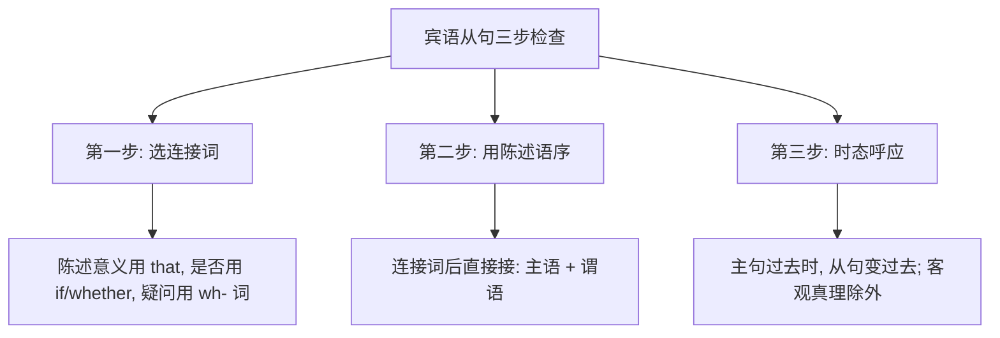

# Unit 3 Language in use

标签：#Module2 #语法总结 #宾语从句 #hope与wish

## 一、模块语法概览

本单元系统总结 Module 2 Education 的核心语法：**宾语从句**（重点是 hope、think、believe、know 等动词后接 that 从句）以及 hope 与 wish 的用法区别。宾语从句是北京中考语法三大从句之首，单选、语法填空、写作都会考。

## 二、语法讲解：宾语从句三要素

### 1. 连接词

| 从句类型 | 连接词 | 例句 |
| --- | --- | --- |
| 陈述句 | that（可省略） | I hope (that) we can win. |
| 一般疑问句 | if / whether | I wonder if he will come. |
| 特殊疑问句 | what, when, where, who, how 等 | Do you know where he lives? |

### 2. 语序：一律用陈述语序

- ❌ Do you know where does he live? → ✅ Do you know **where he lives**?

### 3. 时态呼应

- 主句是**一般现在时**，从句按实际需要选时态：I think he **will come**.
- 主句是**一般过去时**，从句用相应过去时态：He said he **would come**.
- 从句是**客观真理**，永远用一般现在时：The teacher said the earth **goes** around the sun.

## 三、hope 与 wish 复习

- hope + that 从句（可实现）：I hope you can join us.
- hope to do：I hope to study in Beijing.
- wish sb. sth.（祝愿）：Wish you all the best!
- wish sb. to do：Mother wishes me to be a doctor.
- 不存在 hope sb. to do 结构。

## 四、易错点

1. ❌ I don't think he **can't** pass. → ✅ I **don't think** he **can** pass.（否定前移，think/believe 类）
2. ❌ Could you tell me when **does the class begin**? → ✅ ...when **the class begins**?
3. if 在宾语从句中意为"是否"，与 whether 可换；但 whether or not / 介词后只能用 whether。
4. 主句过去时+从句客观真理仍用现在时：He said light **travels** faster than sound.

## 五、背记要点

- 口诀：一连（连接词）二序（陈述语序）三时态（呼应）。
- 否定前移动词：think, believe, suppose, expect。
- 高频引导动词：hope, know, wonder, say, tell, ask, find, hear。

## 六、自测题

1. 单选：Could you tell me ______?（A. where does Tom live  B. where Tom lives  C. where Tom live  D. where lives Tom）
2. 单选：I wonder ______ the exchange students will visit our school.（A. that  B. if  C. what  D. who）
3. 单选：The teacher told us that the sun ______ in the east.（A. rise  B. rose  C. rises  D. will rise）
4. 同义句：I think. + He is not right. → I ______ think he ______ right.
5. 语法填空：I hope ______ (visit) London one day.

**答案**：1. B  2. B  3. C  4. don't; is  5. to visit

## 相关知识点

[[Unit 1]] ｜ [[Unit 2]]
