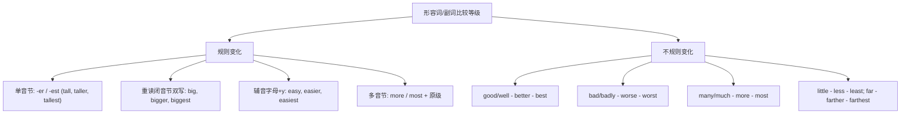

# Unit 1

标签：#Module3 #LifeNowAndThen #比较级最高级 #听说课 ｜ 课文：Life is better today than in the past.

## 一、课文精讲

本单元是 Module 3 Life now and then 的听说课。对话中，同学们采访了爷爷奶奶一辈，比较"过去与现在的生活"：过去人们住得挤、交通不便、通讯靠写信；现在住房更宽敞、出行更快捷、可以随时视频通话。大家得出结论：Life is **better** today **than** in the past.（今天的生活比过去更好。）

语言重点是**形容词、副词比较级和最高级的复习与运用**：谈"现在 vs 过去"必然大量使用 better、worse、more comfortable、much faster 等比较结构，这也是北京中考单选和作文"变化类"话题的核心语言。

关键句：
- Life is **better** today **than** in the past. 今天的生活比过去好。
- People **used to** write letters, but now we send messages. 人们过去写信，现在发信息。
- Travel is **much faster and more comfortable** than before.
- It was **one of the most difficult** periods in her life.

## 二、重点词汇与短语

| 词汇 | 词性 | 释义 | 例句 |
| --- | --- | --- | --- |
| handbag | n. | 手提包 | She lost her handbag. |
| transport | n. | 交通；运输 | Public transport is convenient. |
| couple | n. | 夫妇；两个 | The old couple live nearby. |
| single | adj. | 单一的；单身的 | He made a single mistake. |
| nowadays | adv. | 如今 | Nowadays most people have phones. |
| used to do | 短语 | 过去常常 | I used to walk to school. |
| in the past | 短语 | 在过去 | Life was hard in the past. |
| compared with | 短语 | 与……相比 | Compared with then, we live better. |

## 三、重点句型

1. A is **比较级 + than** B：Life is better today than in the past.
2. **used to do** sth.：People used to cook over open fires.
3. **much / a little / even + 比较级**：Houses are much bigger now.
4. **one of the + 最高级 + 复数名词**：Beijing is one of the biggest cities in China.

## 四、语法讲解：比较等级复习

比较级修饰语：much, a lot, far, even, a little, a bit（❌ very + 比较级）。

## 五、易错点

1. ❌ Life is **more better** now. → ✅ Life is **much better** now.（better 已是比较级）
2. than 后代词比较对象要一致：My bag is bigger than **yours**（不是 than you）。
3. used to do（过去常常）≠ be used to doing（习惯于）≠ be used to do（被用来做）。
4. one of the + 最高级后接**复数名词**，谓语用单数：One of the most popular sports **is** football.

## 六、背记要点

- 比较级三件套：比较级 + than / much 等修饰语 / 同类相比。
- 最高级三件套：the + 最高级 / of + 范围（同类）或 in + 范围（场所）。
- "过去 vs 现在"话题词块：in the past, nowadays, used to, these days, at that time。

## 七、自测题

1. 单选：Travel today is ______ than it was fifty years ago.（A. very fast  B. much faster  C. more faster  D. the fastest）
2. 单选：My grandpa ______ live in a small village, but now he lives in the city.（A. is used to  B. used to  C. uses to  D. was used to）
3. 完成句子：这是我看过的最有趣的电影之一。This is one of ______ ______ interesting films I have ever seen.
4. 汉译英：与过去相比，如今的交通快多了。

**答案**：1. B  2. B  3. the most  4. Compared with the past, transport is much faster nowadays.

## 相关知识点

[[Unit 2]] ｜ [[Unit 3 Language in use]]
