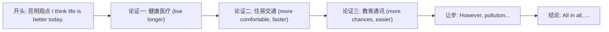

# Unit 2

标签：#Module3 #LifeNowAndThen #读写课 #对比类作文 ｜ 课文：I think life is better today.

## 一、课文精讲

本单元是 Module 3 Life now and then 的读写课。课文 I think life is better today. 是一篇观点对比文章：作者从**健康与寿命、居住条件、交通与通讯、教育机会**等方面对比过去与现在的生活，认为如今人们寿命更长、生活更便利、受教育机会更多，因此"今天的生活更好"；同时也客观提到现代生活的问题，如环境污染和生活节奏快。

文章结构是典型的**观点—论证—让步—结论**：先亮观点（I think life is better today），分点用比较级论证，再用 however 承认另一面，最后重申结论。写作任务是"过去与现在生活对比"短文，直接对接北京中考"变化与发展"类作文。

关键句：
- **I think** life is better today **than** in the past.
- People live **longer** than they **used to**. 人们比过去活得更长。
- **However**, life today is not perfect. 然而，今天的生活并不完美。
- **All in all**, I believe we are luckier than people in the past.

## 二、重点词汇与短语

| 词汇 | 词性 | 释义 | 例句 |
| --- | --- | --- | --- |
| seek | v. | 寻找；谋求 | People seek a better life. |
| medical | adj. | 医疗的 | Medical care is much better. |
| treatment | n. | 治疗 | New treatments save lives. |
| flat | n. | 公寓 | They live in a small flat. |
| space | n. | 空间 | We have more living space now. |
| all in all | 短语 | 总的来说 | All in all, life is better. |
| what's more | 短语 | 而且 | What's more, education is free. |
| keep in touch with | 短语 | 与……保持联系 | We keep in touch with friends online. |

## 三、重点句型

1. People live **longer than they used to**.（比较级 + than + 省略句）
2. **However**, there are also problems, **such as** pollution.
3. **The + 比较级..., the + 比较级...**：The more we learn, the luckier we are.
4. **All in all / In conclusion**, I believe...（总结句型）

## 四、对比类作文结构

对比写作句式库：In the past, people used to... / Nowadays, ... / Compared with then, ... / ...much + 比较级 + than before。

## 五、易错点

1. than they used to 后省略了 live，不要重复写成 than they used to live longer。
2. however 是副词，句间用分号或句号加逗号：Life is good. **However,** ...（不能像 but 直接连句）。
3. "the more..., the more..." 结构中两个分句都用陈述语序。
4. such as 举例不加逗号列举全部；for example 后接完整句子。

## 六、背记要点

- 论证衔接词：first, what's more, in addition, however, all in all。
- 对比高频词块：live longer, medical treatment, living conditions, at a faster pace。
- 让步表达：Although life is better, there are still problems.

## 七、自测题

1. 单选：______ hard you work, ______ progress you will make.（A. The; the  B. The harder; the more  C. Harder; more  D. The hard; the more）
2. 单选：People today live much ______ than before thanks to medical treatment.（A. long  B. longer  C. longest  D. the longest）
3. 完成句子：总的来说，我认为今天的生活更好。______ ______ ______, I think life is better today.
4. 书面表达（列提纲）：Life now and then——从交通、通讯两方面对比过去与现在。

**答案**：1. B  2. B  3. All in all  4. 略（每方面一组 used to 与比较级句即可）

## 相关知识点

[[Unit 1]] ｜ [[Unit 3 Language in use]]
