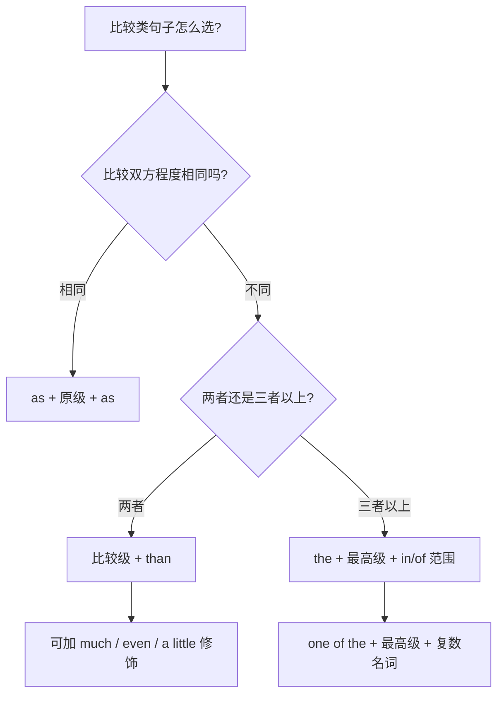

# Unit 3 Language in use

标签：#Module3 #语法总结 #比较级 #最高级 #同级比较

## 一、模块语法概览

本单元系统总结 Module 3 Life now and then 的核心语法：**形容词与副词的比较等级**（原级、比较级、最高级）。北京中考对该考点的考查形式有：单选辨析、词形填空（给原级写比较级）、以及作文中的正确运用。

## 二、语法讲解

### 1. 三级形式与用法

| 等级 | 结构 | 例句 |
| --- | --- | --- |
| 原级（同级比较） | as + 原级 + as / not as(so) + 原级 + as | He runs as fast as I do. |
| 比较级 | 比较级 + than | Life is better than before. |
| 最高级 | the + 最高级 + in/of 范围 | She is the tallest in her class. |

### 2. 变化规则

- 单音节加 -er/-est：tall → taller → tallest。
- 重读闭音节双写尾字母：big → bigger → biggest；hot → hotter → hottest。
- 辅音字母 + y 变 i：easy → easier → easiest。
- 多音节加 more/most：more beautiful, most important。
- 不规则：good/well→better→best；bad/badly/ill→worse→worst；many/much→more→most；little→less→least；far→farther/further→farthest/furthest。

### 3. 结构选择流程

### 4. 高频特殊结构

1. **比较级 + and + 比较级**：越来越……：more and more crowded。
2. **the + 比较级, the + 比较级**：越……越……。
3. **否定 + 比较级 = 最高级**：Nothing is more important than health.
4. **Which/Who is + 比较级, A or B?** 二者选择疑问。

## 三、易错点

1. ❌ He is taller than **any student** in his class. → ✅ than **any other student**（排除自己）。
2. ❌ very + 比较级 → ✅ much/far/even + 比较级。
3. as...as 的否定：not as(so) + 原级 + as，中间必须用原级。
4. 副词最高级前 the 可省：He runs (the) fastest of all。
5. farther 指距离，further 指程度（further education 深造）。

## 四、背记要点

- 口诀：两比 -er 加 than，三比 the -est 定范围；同级 as...as 原级不变。
- 修饰比较级五词：much, far, even, a little, a bit。
- in + 场所范围（in our class）；of + 同类范围（of the three）。

## 五、自测题

1. 单选：Beijing is one of ______ cities in the world.（A. big  B. bigger  C. the biggest  D. biggest）
2. 单选：This film is ______ more interesting than that one.（A. very  B. much  C. too  D. so）
3. 单选：Tom runs as ______ as Jack.（A. fast  B. faster  C. fastest  D. the fastest）
4. 词形填空：The weather is getting ______ and ______ (warm).
5. 单选：China is larger than ______ country in Africa.（A. any  B. any other  C. other  D. the other）

**答案**：1. C  2. B  3. A  4. warmer; warmer  5. A（不同范围无需 other）

## 相关知识点

[[Unit 1]] ｜ [[Unit 2]]
