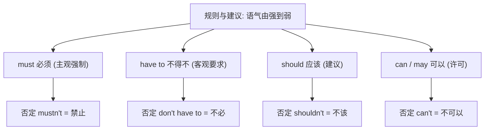

# Unit 1

标签：#Module4 #RulesAndSuggestions #情态动词 #听说课 ｜ 课文：You must be careful of falling stones.

## 一、课文精讲

本单元是 Module 4 Rules and suggestions 的听说课。情境是同学们计划去山区进行野外旅行，老师和向导在出发前讲解**安全规则与建议**：必须小心落石（You must be careful of falling stones.）、不能单独行动、应该带够水和地图、可以在指定地点休息等。对话中密集出现情态动词，用来区分"必须做、禁止做、建议做、允许做"。

语言重点是**情态动词表规则与建议**：must / mustn't / have to / should / shouldn't / can / can't / need 的语气强弱与场景选择，是北京中考单选和情景交际的常考点。

关键句：
- You **must be careful of** falling stones. 你们必须小心落石。
- You **mustn't go off** on your own. 你们不许独自离队。
- You **should take** enough water with you. 你们应该带足够的水。
- We **don't have to** start early tomorrow. 我们明天不必早出发。

## 二、重点词汇与短语

| 词汇 | 词性 | 释义 | 例句 |
| --- | --- | --- | --- |
| stone | n. | 石头 | Be careful of falling stones. |
| path | n. | 小路 | Keep to the path. |
| suggestion | n. | 建议 | May I make a suggestion? |
| danger | n. | 危险 | Keep away from danger. |
| dark | n./adj. | 黑暗（的） | Come back before dark. |
| be careful of | 短语 | 当心…… | Be careful of the traffic. |
| on one's own | 短语 | 独自 | Don't climb on your own. |
| keep to | 短语 | 沿着；遵守 | Keep to the main road. |

## 三、重点句型

1. You **must** do... / You **mustn't** do...（必须/禁止）
2. You **should / shouldn't** do...（建议做/不该做）
3. You **don't have to** do...（不必做，注意与 mustn't 区别）
4. **What/How about doing...? / Why not do...?**（提建议的疑问句式）

## 四、语法讲解：情态动词表规则与建议

核心对比：**mustn't（禁止）≠ don't have to（不必）**。回答 Must I...? 时，肯定答 Yes, you must.，否定答 **No, you needn't. / No, you don't have to.**

## 五、易错点

1. ❌ —Must I finish it now? —No, you **mustn't**. → ✅ No, you **needn't / don't have to**.
2. 情态动词后接**动词原形**：must **be** careful，❌ must to be / must being。
3. have to 有人称和时态变化（has to / had to），must 没有过去式（过去用 had to）。
4. Why not do...? = Why don't you do...?，not 后接原形。

## 六、背记要点

- 禁止四连：mustn't / can't / Don't do... / No + doing（No smoking）。
- 建议五式：should do / had better do / Why not do / What about doing / Let's do。
- 野外安全词块：be careful of, keep to the path, on one's own, before dark。

## 七、自测题

1. 单选：You ______ be careful of falling stones when climbing.（A. can  B. must  C. may  D. need）
2. 单选：—Must we hand in the report today? —No, you ______.（A. mustn't  B. can't  C. needn't  D. shouldn't）
3. 单选：In the mountains, you ______ go off on your own. It's dangerous.（A. mustn't  B. don't have to  C. needn't  D. may not）
4. 汉译英：你们应该带足够的水，天黑前必须回到营地。

**答案**：1. B  2. C  3. A  4. You should take enough water and you must return to the camp before dark.

## 相关知识点

[[Unit 2]] ｜ [[Unit 3 Language in use]]
