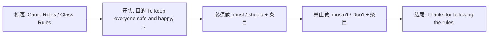

# Unit 2

标签：#Module4 #RulesAndSuggestions #读写课 #露营规则 ｜ 课文：We must keep the camp clean.

## 一、课文精讲

本单元是 Module 4 Rules and suggestions 的读写课。课文 We must keep the camp clean. 是一份**夏令营营规**（camp rules）：内容涵盖作息时间（准时起床熄灯）、饮食卫生（饭前洗手、不许把食物带进帐篷）、安全纪律（不得单独游泳、离营须报告）、环保要求（保持营地清洁、垃圾入桶、爱护动植物）等。

文体是**规章类应用文**，语言特点是大量使用 must / mustn't / should / can 和祈使句，条理分明地分条列出。写作任务是为班级活动或图书馆等场所拟一份规则，正对应北京中考应用文"规则/通知"类写作。

关键句：
- We **must keep** the camp **clean**. 我们必须保持营地清洁。
- You **mustn't bring** food into your tent. 不许把食物带进帐篷。
- Campers **should get up** on time and make their beds.
- **Remember to** put rubbish in the bins. 记得把垃圾放进垃圾桶。

## 二、重点词汇与短语

| 词汇 | 词性 | 释义 | 例句 |
| --- | --- | --- | --- |
| camp | n./v. | 营地；露营 | We must keep the camp clean. |
| tent | n. | 帐篷 | Don't eat in the tent. |
| rubbish | n. | 垃圾 | Put rubbish in the bins. |
| insect | n. | 昆虫 | Food brings insects into tents. |
| lamp | n. | 灯 | Turn off the lamps at ten. |
| keep + 宾语 + adj. | 句型 | 使……保持 | Keep the camp clean. |
| make one's bed | 短语 | 整理床铺 | Make your bed every morning. |
| put out | 短语 | 熄灭 | Put out the fire before you leave. |

## 三、重点句型

1. **keep + 宾语 + 形容词**：We must keep the camp clean.（keep the classroom quiet）
2. **Remember to do** sth.：Remember to turn off the lights.
3. **It is + adj. + to do**：It is important to follow the rules.
4. 祈使句表规则：**Don't** swim alone. / **Always** wash your hands before meals.

## 四、规则类应用文写作

写作技巧：每条规则一句话，动词开头或情态动词开头；"必须类"与"禁止类"分组呈现；可加理由（..., or it may be dangerous.）使表达更充分。

## 五、易错点

1. keep + 宾语 + **形容词**（不是副词）：keep the camp **clean**，❌ keep the camp cleanly。
2. rubbish 不可数：some rubbish，❌ rubbishes。
3. remember **to do**（记得去做，未做）与 remember **doing**（记得做过）意义不同。
4. 祈使句否定直接加 Don't，主语 you 通常省略。

## 六、背记要点

- 规则高频动词块：keep... clean/quiet, put out the fire, make the bed, hand in, be on time。
- "必须/禁止/建议"三档语气：must — mustn't — should。
- 应用文格式：标题 + 开头目的句 + 分条规则 + 结束语。

## 七、自测题

1. 单选：We must keep our classroom ______.（A. clean  B. cleaning  C. cleaned  D. cleanly）
2. 单选：______ to put out the fire before you go to bed.（A. Remembering  B. Remember  C. To remember  D. Remembered）
3. 完成句子：不许把食物带进帐篷。You ______ ______ food into your tent.
4. 书面表达（列提纲）：为学校图书馆写 4 条规则（两条 must，两条 mustn't）。

**答案**：1. A  2. B  3. mustn't bring  4. 略（如 You must keep quiet. / You mustn't eat in the library. 等）

## 相关知识点

[[Unit 1]] ｜ [[Unit 3 Language in use]]
