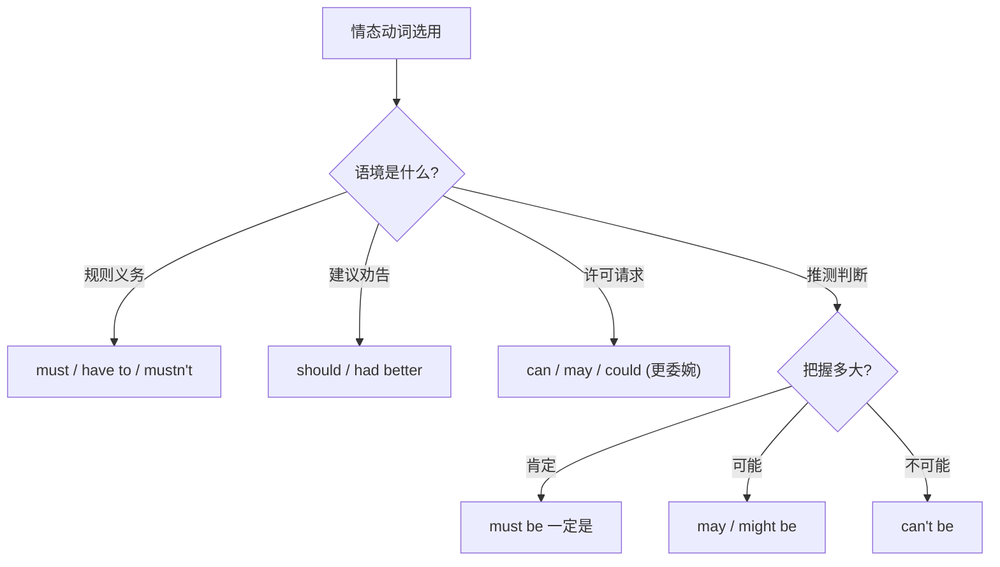

# Unit 3 Language in use

标签：#Module4 #语法总结 #情态动词 #规则与建议

## 一、模块语法概览

本单元系统总结 Module 4 Rules and suggestions 的核心语法：**情态动词**的意义、用法及其在"规则与建议"语境中的选择。情态动词是北京中考单选的必考点，重点考查 must/have to、mustn't/needn't、can/may 的辨析以及情态动词表推测。

## 二、语法讲解

### 1. 常用情态动词一览

| 情态动词 | 基本含义 | 否定式含义 | 例句 |
| --- | --- | --- | --- |
| must | 必须（主观） | mustn't 禁止 | You must stop at the red light. |
| have to | 不得不（客观） | don't have to 不必 | I had to stay at home yesterday. |
| should | 应该（建议） | shouldn't 不应该 | You should eat more vegetables. |
| can | 能够；可以 | can't 不能；不可能 | You can rest here. |
| may | 可以；可能 | may not 可能不 | May I come in? |
| need | 需要 | needn't 不必 | You needn't come early. |

### 2. 三条主线

1. **表规则**：must（必须）/ mustn't（禁止）/ can（允许）。
2. **表建议**：should / had better / Why not do...?
3. **表推测**：must be（一定是，肯定推测）/ may be（可能是）/ can't be（不可能是，否定推测）。

### 3. 共性规则

- 情态动词后一律接**动词原形**，无人称变化：She must **go**.
- 疑问句将情态动词提前：**Must** I hand it in now?
- have to 例外：需借助 do 构成疑问和否定，且有时态变化（had to）。

## 三、易错点

1. Must I...? 的否定回答用 **needn't / don't have to**，不用 mustn't。
2. mustn't = 禁止；don't have to = needn't = 不必，二者不可互换。
3. 推测句：The light is on, so he **must** be at home.（不用 can）；否定推测用 **can't**，不用 mustn't。
4. had better 后接原形，否定为 had better **not** do。

## 四、背记要点

- 口诀：must 主观 have to 客观；禁止 mustn't，不必 needn't。
- 推测三档：must（90% 以上）> may/might（50%）> can't（不可能）。
- 委婉请求：Could/May I...? 比 Can I...? 更礼貌。

## 五、自测题

1. 单选：—May I go swimming now? —No, you ______. You must finish your homework first.（A. mustn't  B. needn't  C. couldn't  D. won't）
2. 单选：The classroom light is still on. The students ______ be having a meeting.（A. can  B. must  C. need  D. mustn't）
3. 单选：—Must I wear the uniform? —No, you ______.（A. mustn't  B. can't  C. don't have to  D. shouldn't）
4. 单选：You'd better ______ too late, or you'll feel tired in class.（A. not stay up  B. not to stay up  C. don't stay up  D. stay not up）
5. 语法填空：Tom isn't in the classroom. He ______ (can) be in the library, but I'm not sure.

**答案**：1. A  2. B  3. C  4. A  5. may/might

## 相关知识点

[[Unit 1]] ｜ [[Unit 2]]
