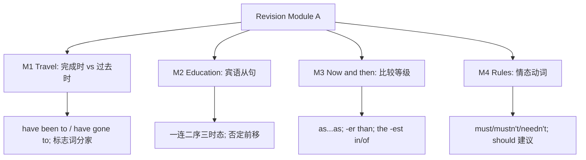

# Revision Module A

标签：#RevisionA #综合复习 #Module1至4 #中考一轮

## 一、复习范围概览

Revision Module A 综合复习 Module 1–4 的话题与语法：M1 Travel（现在完成时与一般过去时）、M2 Education（宾语从句、hope/wish）、M3 Life now and then（比较等级）、M4 Rules and suggestions（情态动词）。本单元通过听力、阅读和写作综合练习把四个模块的语言点串联起来，是九下第一阶段的一轮复习节点。

## 二、四大语法要点回扣

### 1. 现在完成时 vs 一般过去时（M1）
- 有具体过去时间（yesterday, ago, last...）用过去时；表经历/结果（ever, yet, already, so far）用完成时。
- have been to（去过已回）≠ have gone to（去了未回）；短暂动词不与 for + 时间段连用。

### 2. 宾语从句（M2）
- 连接词：that（可省）/ if, whether / wh- 词；从句一律**陈述语序**。
- 主句过去时从句跟着过去；客观真理永用一般现在时；think/believe 否定前移。

### 3. 比较等级（M3）
- as + 原级 + as；比较级 + than；the + 最高级 + in/of 范围。
- much/even/a little 修饰比较级；than any other + 单数（同范围内）。

### 4. 情态动词（M4）
- must（必须）/ mustn't（禁止）/ needn't = don't have to（不必）。
- Must I...? 否定答 No, you needn't.；推测 must be / may be / can't be。

## 三、话题词汇整合

| 话题 | 核心词块 |
| --- | --- |
| 旅行 | take off, land, on time, because of, tour the city |
| 教育 | exchange, encourage sb. to do, take part in, in person |
| 今昔对比 | used to do, nowadays, in the past, keep in touch with |
| 规则建议 | be careful of, on one's own, keep... clean, put out |

## 四、易错点集中清查

1. ❌ I have seen him yesterday. → ✅ I saw him yesterday.
2. ❌ Do you know where does he live? → ✅ ...where he lives?
3. ❌ Life is more better now. → ✅ much better。
4. ❌ —Must I go now? —No, you mustn't. → ✅ No, you needn't.
5. used to do（过去常常）≠ be used to doing（习惯于）。

## 五、背记要点

- 时态口诀：过去时间过去时，经历结果完成时。
- 从句口诀：一连二序三时态。
- 比较口诀：两比 than 三比 the -est。
- 情态口诀：禁止 mustn't，不必 needn't。

## 六、综合自测题

1. 单选：—Have you ever ______ to Xi'an? —Yes, I ______ there last year.（A. gone; went  B. been; went  C. been; have gone  D. gone; have been）
2. 单选：Could you tell me ______ tomorrow?（A. if it rains  B. whether it will rain  C. if will it rain  D. whether does it rain）
3. 单选：Air travel is ______ than train travel, but it costs more.（A. fast  B. faster  C. fastest  D. the fastest）
4. 单选：You ______ shout in the reading room. Keep quiet, please.（A. needn't  B. mustn't  C. don't have to  D. may not）
5. 语法填空：The teacher said the earth ______ (go) around the sun.

**答案**：1. B  2. B  3. B  4. B  5. goes

## 相关知识点

[[Unit 3 Language in use]]（各 Module 语法总结篇）｜ 下一阶段见 [[Revision Module B]]
