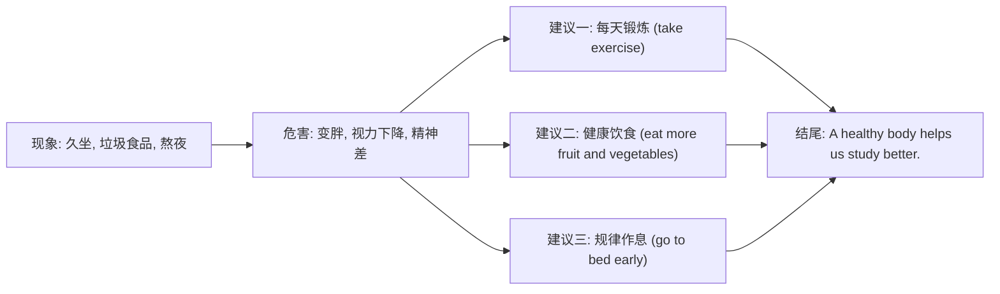

# Unit 2

标签：#Module5 #LookAfterYourself #读写课 #健康生活 ｜ 课文：Get off the sofa!

## 一、课文精讲

本单元是 Module 5 Look after yourself 的读写课。课文 Get off the sofa! 是一篇**健康建议类说明文**，批评"沙发土豆"（couch potato）式的生活方式：许多青少年久坐看电视、玩电脑、吃垃圾食品、缺乏锻炼，导致肥胖和健康问题。文章呼吁大家"离开沙发"，给出具体建议：每天锻炼、多吃水果蔬菜、少喝含糖饮料、保证睡眠。

文章结构为"现象—危害—建议"，语言上大量使用祈使句和 should / had better 建议句型。写作任务是给同学写一封健康建议信/短文，这与北京中考"健康生活"类书面表达完全对应。

关键句：
- **Get off the sofa** and do some exercise! 离开沙发去锻炼吧！
- **Too much** sugar and fat **is bad for** your health. 过多的糖和脂肪有害健康。
- You should exercise **at least** three times a week.
- **The more** you exercise, **the healthier** you will be.

## 二、重点词汇与短语

| 词汇 | 词性 | 释义 | 例句 |
| --- | --- | --- | --- |
| condition | n. | 状况 | He is in good condition. |
| pain | n. | 疼痛 | I have a pain in my back. |
| weak | adj. | 虚弱的 | She feels weak after the illness. |
| illness | n. | 疾病 | Exercise prevents illness. |
| get off | 短语 | 离开；下（车） | Get off the sofa! |
| be bad for | 短语 | 对……有害 | Junk food is bad for us. |
| at least | 短语 | 至少 | Sleep at least eight hours. |
| take exercise | 短语 | 锻炼 | Take more exercise every day. |

## 三、重点句型

1. 祈使句劝告：**Get off** the sofa! / **Don't spend** hours playing computer games!
2. **too much + 不可数名词**：Too much screen time is harmful.
3. **be good / bad for**：Vegetables are good for your health.
4. **The + 比较级, the + 比较级**：The more you exercise, the healthier you are.

## 四、健康建议类写作结构

建议信常用句式：I'm sorry to hear that... / You'd better... / Why not...? / I hope you will feel better soon.

## 五、易错点

1. too much + 不可数名词（too much sugar）；too many + 可数复数（too many snacks）。
2. exercise 表"锻炼"不可数（take exercise）；表"练习/体操"可数（do morning exercises）。
3. spend 时间 (in) doing sth.：spend hours **watching** TV。
4. get off the sofa 中 off 是介词"离开……"，不同于 get off a bus 的"下车"义但结构相同。

## 六、背记要点

- 健康话题四组词块：take exercise / keep fit / stay healthy / build up。
- 劝告三连：You'd better... / You should... / Why not...?
- 频率表达：three times a week, at least eight hours a day。

## 七、自测题

1. 单选：Eating ______ sugar is bad for your teeth.（A. too many  B. too much  C. much too  D. many too）
2. 单选：______ you exercise, ______ you will be.（A. The more; the healthier  B. More; healthier  C. The most; the healthiest  D. The more; healthier）
3. 完成句子：你应该每周至少锻炼三次。You should exercise ______ ______ three times a week.
4. 书面表达（列提纲）：给沉迷电脑的朋友写三条健康建议。

**答案**：1. B  2. A  3. at least  4. 略（三个不同建议句型即可）

## 相关知识点

[[Unit 1]] ｜ [[Unit 3 Language in use]]
