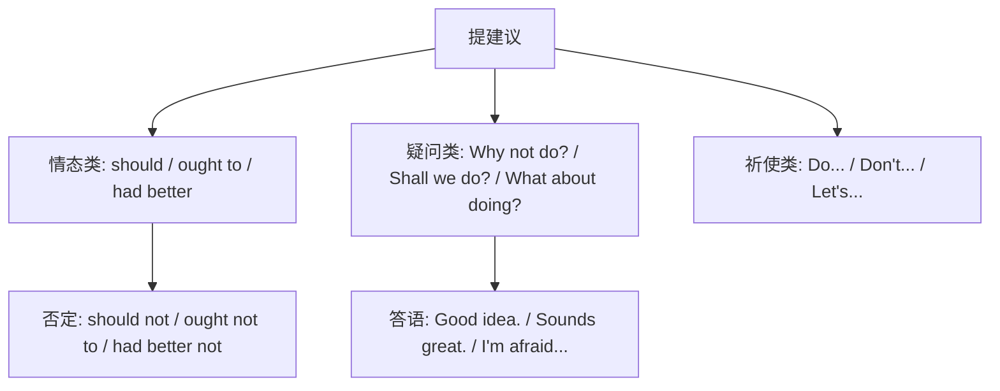

# Unit 3 Language in use

标签：#Module5 #语法总结 #建议句型 #hadbetter #should

## 一、模块语法概览

本单元系统总结 Module 5 Look after yourself 的核心语法：**表建议与劝告的句型体系**，以 had better 和 should 为主，兼顾 Why not / What about / ought to 等表达，并整合"健康"话题的功能句。北京中考情景交际题几乎每年都涉及建议句型的选择与应答。

## 二、语法讲解

### 1. 建议句型总表

| 句型 | 后接形式 | 语气特点 | 例句 |
| --- | --- | --- | --- |
| You should... | 动词原形 | 一般建议 | You should see a doctor. |
| You'd better... | 动词原形 | 较急切，含轻微警告 | You'd better not go out. |
| Why not...? | 动词原形 | 委婉提议 | Why not take a walk? |
| What/How about...? | doing | 征求意见 | What about drinking more water? |
| Let's... | 动词原形 | 包括双方 | Let's do more exercise. |
| ought to... | 动词原形 | 同 should，稍正式 | You ought to rest. |

### 2. 结构树

### 3. 建议的应答

- 接受：Good idea! / Sounds great! / OK, I will.
- 婉拒：I'm afraid I can't. / Thanks, but...

### 4. 健康话题功能句整合

What's wrong with you? → I've got a headache. → You'd better take some medicine and lie down. → Thank you, doctor.

## 三、易错点

1. had better 中 had 不能换成 would；否定 not 紧跟 better 之后。
2. Why not do sth.? = Why don't you do sth.?，两者都接**原形**。
3. What about / How about 后必须接 **doing** 或名词。
4. should 之后不加 to；ought 之后必须加 to（ought to do）。
5. Let's 的反意疑问：Let's go, **shall we**?

## 四、背记要点

- 接原形四兄弟：should, had better, Why not, Let's。
- 接 doing 两兄弟：What about, How about。
- 语气排序（弱→强）：What about < Why not < should < had better < must。

## 五、自测题

1. 单选：—I have a toothache. —You ______ eat too much candy.（A. had better not  B. had not better  C. would better not  D. had better）
2. 单选：______ going out for a walk after dinner?（A. Why not  B. What about  C. Why don't  D. You should）
3. 单选：You ought ______ your homework before watching TV.（A. finish  B. to finish  C. finishing  D. finished）
4. 补全对话：—What's wrong with you? —______（我头疼）. —You'd better ______（吃点药并休息）.
5. 单选：Let's take more exercise, ______?（A. will you  B. shall we  C. don't we  D. do we）

**答案**：1. A  2. B  3. B  4. I've got a headache; take some medicine and have a rest  5. B

## 相关知识点

[[Unit 1]] ｜ [[Unit 2]]
