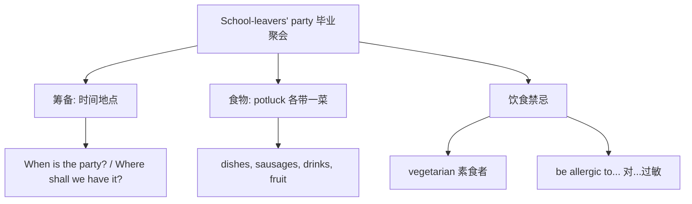

# Unit 1

标签：#Module6 #EatingTogether #毕业聚会 #听说课 ｜ 课文：When is the school-leavers' party?

## 一、课文精讲

本单元是 Module 6 Eating together 的听说课。毕业临近，同学们在筹备**毕业生聚会**（the school-leavers' party）：讨论聚会的时间地点、每人带什么食物（potluck 形式）、需要注意哪些饮食禁忌——例如有的同学不吃肉（vegetarian）、有人对某些食物过敏。对话中还比较了不同国家的聚会食物和饮食习惯。

语言重点：询问与安排活动的功能句（When is...? / What shall we bring?），以及**被动语态的初步感知**（The party is planned for next week.），为 Unit 2 集中学习被动语态铺垫。"聚会筹备"是北京中考听说考试的常见情境。

关键句：
- **When is** the school-leavers' party? 毕业聚会是什么时候？
- Everyone **is expected to** bring some food. 每个人都要带些食物来。
- Sally **doesn't eat meat**—she's a vegetarian. Sally 不吃肉——她是素食者。
- **What shall we bring** to the party? 我们给聚会带点什么？

## 二、重点词汇与短语

| 词汇 | 词性 | 释义 | 例句 |
| --- | --- | --- | --- |
| pity | n. | 遗憾 | What a pity you can't come! |
| serve | v. | 端上（食物）；服务 | Dumplings are served hot. |
| offer | v. | 主动提供 | He offered to bring drinks. |
| dish | n. | 菜肴；碟 | It's a traditional Chinese dish. |
| sausage | n. | 香肠 | I'll bring some sausages. |
| school-leaver | n. | 毕业生 | The school-leavers' party is in June. |
| would like to do | 短语 | 想要做 | I'd like to help with the party. |
| turn up | 短语 | 出现；到场 | Everyone turned up on time. |

## 三、重点句型

1. **When / Where is** the party?（询问活动安排）
2. **What shall we bring?** — Let's bring some fruit.（商量分工）
3. **What a pity!** 真遗憾！（感叹应答）
4. **I'd like to do** sth. / **Would you like to do** sth.?（表意愿与邀请）

## 四、话题词汇导图

听力抓取要点：时间、地点、每人带的食物、特殊饮食要求，这四类信息是设题点。

## 五、易错点

1. school-leavers' party 中 leavers' 是复数名词所有格，撇号在 s 后。
2. Would you like to come? 肯定答 Yes, I'd love/like to.（to 不能丢）。
3. offer to do（主动提出做）≠ provide sb. with sth.（提供某物）。
4. What a pity! 中 pity 前用 a；感叹"多好的主意"同理：What a good idea!

## 六、背记要点

- 邀请与应答：Would you like to...? — I'd love to. / I'm sorry, but I can't.
- 聚会分工句：I'll bring... / Shall we...? / Let's...
- 饮食禁忌表达：He doesn't eat meat. / She can't eat nuts.

## 七、自测题

1. 单选：—Would you like to come to our party? —______, but I have to look after my sister.（A. I'd love to  B. No, I can't  C. Never mind  D. Good idea）
2. 单选：Everyone is expected ______ some food to the party.（A. bring  B. bringing  C. to bring  D. brought）
3. 完成句子：真遗憾你不能来参加毕业聚会！______ ______ ______ you can't come to the school-leavers' party!
4. 情景表达：用两句话询问聚会时间并主动提出带饮料。

**答案**：1. A  2. C  3. What a pity  4. 示例：When is the party? I'd like to bring some drinks.

## 相关知识点

[[Unit 2]] ｜ [[Unit 3 Language in use]]
