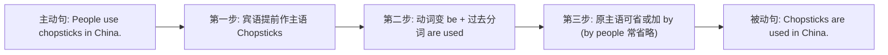

# Unit 2

标签：#Module6 #EatingTogether #被动语态 #读写课 ｜ 课文：Knives and forks are used for most Western food.

## 一、课文精讲

本单元是 Module 6 Eating together 的读写课。课文 Knives and forks are used for most Western food. 介绍**中西方餐桌礼仪与餐具文化**：西餐大多使用刀叉，左手持叉右手持刀；中餐使用筷子，饭碗可以端起；文章还介绍了不同场合的用餐规矩，如不宜用筷子指人、西餐中喝汤不出声等。

文体是**说明文**，语言最大特点是**被动语态**的密集使用：Knives and forks **are used** for...；Chopsticks **are used** in China；Food **is served**... 因为说明"餐具被如何使用"时，动作承受者是话题中心。被动语态是本模块语法主线，也是北京中考核心语法。

关键句：
- **Knives and forks are used for** most Western food. 大多数西餐使用刀叉。
- Chopsticks **are used** in China. 在中国人们使用筷子。
- The soup **is drunk** quietly in the West. 在西方喝汤不出声。
- Rice **is served** in a bowl. 米饭盛在碗里。

## 二、重点词汇与短语

| 词汇 | 词性 | 释义 | 例句 |
| --- | --- | --- | --- |
| knife | n. | 刀（复数 knives） | Knives are used for cutting. |
| fork | n. | 叉 | Hold the fork in your left hand. |
| chopsticks | n. | 筷子（常复数） | Chopsticks are used in China. |
| impolite | adj. | 不礼貌的 | It's impolite to point at people. |
| manners | n. | 礼仪（常复数） | Table manners are important. |
| be used for | 短语 | 被用来做 | A knife is used for cutting. |
| point at | 短语 | 指向 | Don't point at others with chopsticks. |
| pick up | 短语 | 拿起 | You can pick up the bowl. |

## 三、重点句型

1. **A is used for doing / to do** sth.：Chopsticks are used for picking up food.
2. **It is + adj. + to do**：It is impolite to talk with your mouth full.
3. 被动语态一般现在时：**am/is/are + 过去分词**。
4. 对比句式：**In the West..., while in China...**（while 表对比）

## 四、语法讲解：被动语态（一般现在时）

使用场景：①动作执行者不明确或不重要；②强调动作承受者；③说明文中介绍用途、规则、制作过程。be 随主语单复数变化：is used / are used。

## 五、易错点

1. be used **for doing** = be used **to do**（被用来做）≠ be used to doing（习惯于）。
2. 被动语态过去分词要用不规则形式：is **drunk**（drink-drank-drunk），is **eaten**。
3. knife 复数 knives；chopsticks、manners 习惯用复数。
4. ❌ Rice **is serve** in a bowl. → ✅ is **served**（勿丢 -ed）。

## 六、背记要点

- 被动结构公式：be + 过去分词，be 定时态和单复数。
- 餐桌礼仪词块：table manners, be used for, point at, pick up, It's impolite to do。
- 说明文写作可多用被动：... is served / is eaten / is placed...

## 七、自测题

1. 单选：Knives and forks ______ for most Western food.（A. use  B. are used  C. is used  D. used）
2. 单选：A knife is used ______ things.（A. cut  B. to cutting  C. for cutting  D. cutting）
3. 完成句子：在中国吃饭时用筷子。Chopsticks ______ ______ at meals in China.
4. 主动变被动：People serve rice in a bowl. → Rice ______ ______ in a bowl.

**答案**：1. B  2. C  3. are used  4. is served

## 相关知识点

[[Unit 1]] ｜ [[Unit 3 Language in use]]
