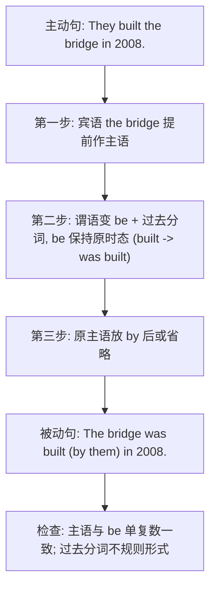

# Unit 3 Language in use

标签：#Module6 #语法总结 #被动语态 #中考核心语法

## 一、模块语法概览

本单元系统总结 Module 6 Eating together 的核心语法：**被动语态**（passive voice），重点是一般现在时与一般过去时的被动式，兼顾含情态动词的被动式。被动语态在北京中考的单选、语法填空和阅读理解中出现频率极高，必须熟练掌握"主动变被动"的转换步骤。

## 二、语法讲解

### 1. 结构总表

| 时态 | 被动结构 | 例句 |
| --- | --- | --- |
| 一般现在时 | am/is/are + done | Rice is grown in the south. |
| 一般过去时 | was/were + done | The bridge was built in 2008. |
| 一般将来时 | will be + done | A new school will be built here. |
| 含情态动词 | 情态动词 + be + done | Rubbish must be put in the bin. |

### 2. 主动变被动三步法

### 3. 使用被动语态的场合

1. 不知道或不必说出动作执行者：My bike **was stolen** yesterday.
2. 强调动作承受者：The Great Wall **is visited** by millions of people.
3. 说明规则、工序、用途：Knives and forks **are used** for Western food.

## 三、易错点

1. 不及物动词无被动：❌ The accident was happened. → ✅ happened（happen, take place, appear 无被动）。
2. 情态动词被动勿丢 be：must **be** kept clean，❌ must kept。
3. 双宾语动词变被动：He gave me a book. → I was given a book. / A book was given **to** me.
4. 短语动词被动介词不能丢：The baby is **looked after** well.
5. by + 人称代词用宾格：by **him**，不是 by he。

## 四、背记要点

- 公式：被动 = be（变时态）+ 过去分词（不变）。
- 三大高频不规则分词：make-made, give-given, write-written；eat-eaten, see-seen, take-taken。
- 中考高频被动句型：be used for / be made of(from) / be known as / be covered with。

## 五、自测题

1. 单选：Paper ______ first ______ in China about 2,000 years ago.（A. is; made  B. was; made  C. is; make  D. was; make）
2. 单选：The classroom must ______ clean every day.（A. keep  B. is kept  C. be kept  D. kept）
3. 单选：A talk on Beijing history ______ in our school next Monday.（A. is given  B. will give  C. will be given  D. gives）
4. 主动变被动：People speak English in many countries. → English ______ ______ in many countries.
5. 改错：The accident was happened at the corner last night.

**答案**：1. B  2. C  3. C  4. is spoken  5. 去掉 was（happen 不用被动）

## 六、拓展：made 系列辨析

- be made **of**：看得出原材料（The desk is made of wood.）
- be made **from**：看不出原材料（Paper is made from trees.）
- be made **in**：产地；be made **by**：制作者。

## 相关知识点

[[Unit 1]] ｜ [[Unit 2]]
