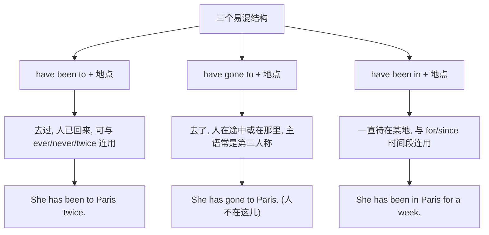

# Unit 1

标签：#Module7 #EnglishForYouAndMe #现在完成时 #听说课 ｜ 课文：Have you ever been to an English corner?

## 一、课文精讲

本单元是 Module 7 English for you and me 的听说课。话题是"学英语的经历与方法"：同学们谈论是否去过英语角（Have you ever been to an English corner?）、学英语遇到的困难（语法难、单词记不住、不敢开口）以及各自的应对办法。大家互相分享经验：多听多说、不怕犯错、坚持每天积累。

语言重点是**现在完成时谈经历**，尤其是 **have been to**（去过某地，人已回来）与 **have gone to**（去了某地，人未回）的区别，配合 ever、never、just、yet 等副词使用。这是北京中考单选的经典考点。

关键句：
- **Have you ever been to** an English corner? 你去过英语角吗？
- I **have never spoken** to a foreigner. 我从未和外国人说过话。
- Don't be afraid of **making mistakes**. 不要害怕犯错。
- My spoken English **has improved a lot**. 我的英语口语提高了很多。

## 二、重点词汇与短语

| 词汇 | 词性 | 释义 | 例句 |
| --- | --- | --- | --- |
| grammar | n. | 语法 | English grammar is not easy. |
| correct | v./adj. | 改正；正确的 | Please correct my mistakes. |
| improve | v. | 提高；改进 | Practice improves your English. |
| sentence | n. | 句子 | Make a sentence with the word. |
| translate | v. | 翻译 | Don't translate word by word. |
| English corner | 短语 | 英语角 | We meet at the English corner. |
| be afraid of | 短语 | 害怕 | Don't be afraid of speaking. |
| make mistakes | 短语 | 犯错误 | Everyone makes mistakes. |

## 三、重点句型

1. **Have you ever been to...?** — Yes, I have. / No, never.
2. **The best way to do... is to do...**：The best way to learn English is to use it.
3. **Don't be afraid of doing** sth.
4. **What/How about doing...?** 分享方法：How about listening to English songs?

## 四、语法讲解：have been to / have gone to / have been in

## 五、易错点

1. ❌ I have **gone** to the Great Wall twice. → ✅ have **been** to（人已回，表经历）。
2. have gone to 一般不用于第一、第二人称（说话双方都在场）。
3. ever 用于疑问句，never 用于肯定形式表否定：I have **never** been there.
4. be afraid of **doing**（介词后接动名词）。

## 六、背记要点

- 口诀：been to 去过已回，gone to 去了没回，been in 待了多久。
- 学英语方法词块：keep a diary in English, listen to English programmes, practice speaking。
- 鼓励用语：Don't give up. / Practice makes perfect.

## 七、自测题

1. 单选：—Where is Li Lei? —He ______ the English corner.（A. has been to  B. has gone to  C. went  D. has been in）
2. 单选：I ______ never ______ to a foreigner before.（A. have; spoken  B. has; spoken  C. have; speak  D. did; speak）
3. 完成句子：你曾经去过英语角吗？______ you ever ______ ______ an English corner?
4. 单选：Mr. Green ______ Beijing for three years.（A. has been to  B. has gone to  C. has been in  D. has come to）

**答案**：1. B  2. A  3. Have; been to  4. C

## 相关知识点

[[Unit 2]] ｜ [[Unit 3 Language in use]]
