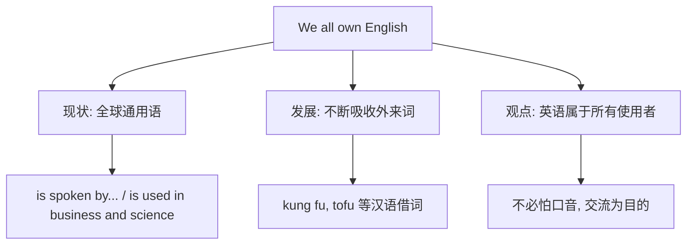

# Unit 2

标签：#Module7 #EnglishForYouAndMe #读写课 #英语的世界地位 ｜ 课文：We all own English.

## 一、课文精讲

本单元是 Module 7 English for you and me 的读写课。课文 We all own English. 介绍**英语作为世界语言的发展与现状**：英语在全球被广泛使用，说英语的非母语者已远多于母语者；英语不断从其他语言借词（如汉语的 kung fu、tofu），各国人也发展出带有本地特色的英语。文章的核心观点是：英语不再只属于英美国家——**We all own English.**（英语属于我们每一个人。）

文章是说明加议论的文体，出现大量数据与被动语态（English **is spoken** by...）。这一话题也帮助同学建立学习自信：说英语不必追求"完美英音美音"，能交流才是目的。

关键句：
- English **is spoken by** more people as a second language than as a first language.
- Many English words **have been borrowed from** other languages.
- **We all own English.** 英语属于我们所有人。
- English **helps us communicate with** the world.

## 二、重点词汇与短语

| 词汇 | 词性 | 释义 | 例句 |
| --- | --- | --- | --- |
| own | v./adj. | 拥有；自己的 | We all own English. |
| communicate | v. | 交流 | We communicate in English. |
| business | n. | 商业；生意 | English is used in business. |
| research | n./v. | 研究 | Much research is done in English. |
| native | adj. | 本土的；母语的 | She is a native speaker. |
| borrow... from | 短语 | 从……借入 | English borrows words from Chinese. |
| all over the world | 短语 | 全世界 | English is used all over the world. |
| more and more | 短语 | 越来越多 | More and more people learn English. |

## 三、重点句型

1. English **is spoken by** millions of people.（被动语态 + by 短语）
2. **More and more** people are learning English.（越来越多）
3. **not only... but also...**：English is used not only in business but also in science.
4. **It doesn't matter if**...：It doesn't matter if you make mistakes.

## 四、话题结构导图

阅读技能：找主旨句（段首段尾）；数据类信息（数字、比较）常设细节题。

## 五、易错点

1. own 作动词"拥有"（own a car），作形容词须与物主词连用：my **own** book。
2. borrow from（借入）与 lend to（借出）方向相反，勿混。
3. native speaker（母语者）中 native 不能换成 nature。
4. more and more + 可数复数/不可数名词均可：more and more people / attention。

## 六、背记要点

- 语言话题词块：first/second language, native speaker, communicate with, all over the world。
- 被动高频句：English is spoken / is used / is taught in many countries.
- 观点句：In my opinion, what matters is communication, not a perfect accent.

## 七、自测题

1. 单选：English ______ by more and more people in the world today.（A. speaks  B. is spoken  C. is speaking  D. was spoken）
2. 单选：Some English words, such as "tofu", were ______ from Chinese.（A. lent  B. borrowed  C. given  D. taken off）
3. 完成句子：越来越多的人正在学习汉语。______ and ______ people are learning Chinese.
4. 汉译英：英语不仅用于商业，还用于科学研究。

**答案**：1. B  2. B  3. More; more  4. English is used not only in business but also in scientific research.

## 相关知识点

[[Unit 1]] ｜ [[Unit 3 Language in use]]
